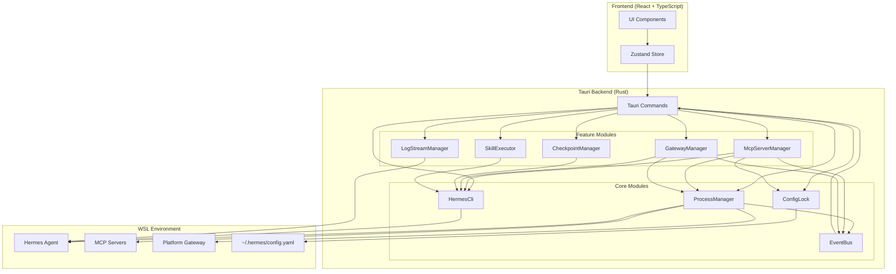

# Design Document: Hermes Agent Integration Improvements

## Overview

本设计文档描述了 Hermes Computer Use 桌面应用中 Hermes Agent 集成功能的完善方案。基于审核报告，当前实现完成度约 75%，存在关键功能缺失和架构问题。本设计旨在：

1. **统一进程管理**：创建统一的进程管理模块，管理 MCP 服务器和 Gateway 进程
2. **统一 CLI 调用**：创建统一的 Hermes CLI 调用层，简化代码维护
3. **配置文件保护**：实现配置文件并发写入保护，防止数据损坏
4. **功能完善**：实现 Checkpoint、Skills 执行、实时日志流等缺失功能
5. **性能优化**：优化性能瓶颈，提升用户体验
6. **错误处理**：增强错误处理，提供清晰的错误信息

### 设计原则

- **单一职责**：每个模块只负责一个明确的功能领域
- **依赖注入**：通过依赖注入实现模块解耦
- **异步优先**：所有 I/O 操作使用 tokio 异步运行时
- **错误传播**：使用 Result 类型和 thiserror 进行错误处理
- **事件驱动**：使用事件系统实现实时状态更新
- **资源安全**：使用 RAII 模式管理资源生命周期

## Architecture

### 系统架构图



### 模块职责

#### Core Modules

1. **ProcessManager**: 统一的进程管理模块
   - 启动、停止、监控进程
   - 进程崩溃检测和自动重启
   - 进程日志捕获
   - 进程状态查询

2. **HermesCli**: 统一的 Hermes CLI 调用层
   - WSL 命令执行
   - 命令超时处理
   - 错误统一格式化
   - 命令日志记录

3. **ConfigLock**: 配置文件锁管理模块
   - 文件锁获取和释放
   - 配置备份和恢复
   - YAML 格式验证
   - 并发写入保护

4. **EventBus**: 事件总线
   - 事件发布和订阅
   - 前端事件推送
   - 异步事件处理

#### Feature Modules

1. **McpServerManager**: MCP 服务器管理器
   - MCP 服务器生命周期管理
   - 工具和资源查询
   - 连接测试
   - 日志管理

2. **GatewayManager**: Gateway 进程管理器
   - Gateway 生命周期管理
   - 平台连接状态查询
   - 日志管理

3. **CheckpointManager**: Checkpoint 管理器
   - 创建和恢复快照
   - 快照元数据管理
   - 快照文件管理

4. **SkillExecutor**: Skills 执行器
   - 技能执行
   - 参数传递
   - 结果捕获
   - 执行历史记录

5. **LogStreamManager**: 日志流管理器
   - 实时日志监控
   - 日志过滤
   - 日志搜索
   - 日志导出


## Components and Interfaces

### 1. ProcessManager

统一的进程管理模块，负责管理所有外部进程的生命周期。

```rust
use tokio::process::{Child, Command};
use tokio::sync::{Mutex, RwLock};
use std::collections::HashMap;
use std::sync::Arc;

/// 进程状态
#[derive(Debug, Clone, PartialEq, Serialize, Deserialize)]
pub enum ProcessStatus {
    Running,
    Stopped,
    Error,
    Starting,
    Stopping,
}

/// 进程信息
#[derive(Debug, Clone)]
pub struct ProcessInfo {
    pub id: String,
    pub pid: Option<u32>,
    pub status: ProcessStatus,
    pub command: String,
    pub args: Vec<String>,
    pub started_at: Option<chrono::DateTime<chrono::Utc>>,
    pub stopped_at: Option<chrono::DateTime<chrono::Utc>>,
    pub restart_count: u32,
    pub last_error: Option<String>,
}

/// 进程配置
#[derive(Debug, Clone)]
pub struct ProcessConfig {
    pub id: String,
    pub command: String,
    pub args: Vec<String>,
    pub env: HashMap<String, String>,
    pub working_dir: Option<String>,
    pub auto_restart: bool,
    pub max_restarts: u32,
    pub restart_delay_ms: u64,
}

/// 进程管理器
pub struct ProcessManager {
    processes: Arc<RwLock<HashMap<String, ProcessHandle>>>,
    event_bus: Arc<EventBus>,
}

/// 进程句柄
struct ProcessHandle {
    info: ProcessInfo,
    config: ProcessConfig,
    child: Option<Child>,
    log_buffer: Arc<Mutex<Vec<String>>>,
}

impl ProcessManager {
    pub fn new(event_bus: Arc<EventBus>) -> Self {
        Self {
            processes: Arc::new(RwLock::new(HashMap::new())),
            event_bus,
        }
    }

    /// 启动进程
    pub async fn start_process(&self, config: ProcessConfig) -> Result<String, ProcessError> {
        // 实现进程启动逻辑
        // 1. 检查进程是否已存在
        // 2. 构建命令
        // 3. 启动进程
        // 4. 捕获输出
        // 5. 更新状态
        // 6. 发送事件
    }

    /// 停止进程
    pub async fn stop_process(&self, id: &str) -> Result<(), ProcessError> {
        // 实现进程停止逻辑
        // 1. 查找进程
        // 2. 发送终止信号
        // 3. 等待进程退出
        // 4. 更新状态
        // 5. 发送事件
    }

    /// 重启进程
    pub async fn restart_process(&self, id: &str) -> Result<(), ProcessError> {
        self.stop_process(id).await?;
        // 从配置重新启动
    }

    /// 获取进程状态
    pub async fn get_process_status(&self, id: &str) -> Result<ProcessInfo, ProcessError> {
        // 返回进程信息
    }

    /// 获取进程日志
    pub async fn get_process_logs(&self, id: &str, lines: usize) -> Result<Vec<String>, ProcessError> {
        // 返回最近的日志行
    }

    /// 监控进程健康状态
    async fn monitor_process(&self, id: String) {
        // 后台任务：监控进程状态
        // 检测崩溃并根据配置自动重启
    }
}
```

### 2. HermesCli

统一的 Hermes CLI 调用层，封装所有与 Hermes Agent 的命令行交互。

```rust
use tokio::process::Command;
use std::time::Duration;

/// Hermes CLI 调用器
pub struct HermesCli {
    wsl_enabled: bool,
    timeout: Duration,
}

/// CLI 执行结果
#[derive(Debug, Clone)]
pub struct CliResult {
    pub stdout: String,
    pub stderr: String,
    pub exit_code: i32,
    pub success: bool,
}

impl HermesCli {
    pub fn new() -> Self {
        Self {
            wsl_enabled: cfg!(windows),
            timeout: Duration::from_secs(30),
        }
    }

    /// 执行 Hermes CLI 命令
    pub async fn execute(&self, args: &[&str]) -> Result<CliResult, CliError> {
        self.execute_with_timeout(args, self.timeout).await
    }

    /// 执行带超时的命令
    pub async fn execute_with_timeout(
        &self,
        args: &[&str],
        timeout: Duration,
    ) -> Result<CliResult, CliError> {
        // 构建命令
        let mut cmd = if self.wsl_enabled {
            let mut c = Command::new("wsl");
            c.arg("-e").arg("hermes");
            c.args(args);
            c
        } else {
            let mut c = Command::new("hermes");
            c.args(args);
            c
        };

        // 执行命令并处理超时
        // 记录日志
        // 返回结果
    }

    /// 会话管理命令
    pub async fn list_sessions(&self) -> Result<Vec<SessionInfo>, CliError> {
        let result = self.execute(&["sessions", "list", "--json"]).await?;
        // 解析 JSON 输出
    }

    pub async fn get_session(&self, id: &str) -> Result<SessionInfo, CliError> {
        let result = self.execute(&["sessions", "get", id, "--json"]).await?;
        // 解析 JSON 输出
    }

    pub async fn delete_session(&self, id: &str) -> Result<(), CliError> {
        self.execute(&["sessions", "delete", id]).await?;
        Ok(())
    }

    /// Checkpoint 管理命令
    pub async fn create_checkpoint(
        &self,
        session_id: &str,
        description: Option<&str>,
    ) -> Result<CheckpointInfo, CliError> {
        let mut args = vec!["checkpoint", "create", session_id];
        if let Some(desc) = description {
            args.push("--description");
            args.push(desc);
        }
        args.push("--json");
        
        let result = self.execute(&args).await?;
        // 解析 JSON 输出
    }

    pub async fn restore_checkpoint(&self, checkpoint_id: &str) -> Result<(), CliError> {
        self.execute(&["checkpoint", "restore", checkpoint_id]).await?;
        Ok(())
    }

    pub async fn list_checkpoints(&self) -> Result<Vec<CheckpointInfo>, CliError> {
        let result = self.execute(&["checkpoint", "list", "--json"]).await?;
        // 解析 JSON 输出
    }

    pub async fn delete_checkpoint(&self, checkpoint_id: &str) -> Result<(), CliError> {
        self.execute(&["checkpoint", "delete", checkpoint_id]).await?;
        Ok(())
    }

    /// Skills 管理命令
    pub async fn list_skills(&self) -> Result<Vec<SkillInfo>, CliError> {
        let result = self.execute(&["skills", "list", "--json"]).await?;
        // 解析 JSON 输出
    }

    pub async fn run_skill(
        &self,
        skill_name: &str,
        args: &[&str],
        dry_run: bool,
    ) -> Result<SkillResult, CliError> {
        let mut cmd_args = vec!["skills", "run", skill_name];
        if dry_run {
            cmd_args.push("--dry-run");
        }
        cmd_args.extend(args);
        cmd_args.push("--json");
        
        let result = self.execute(&cmd_args).await?;
        // 解析 JSON 输出
    }

    /// Gateway 管理命令
    pub async fn start_gateway(&self) -> Result<(), CliError> {
        self.execute(&["gateway", "start"]).await?;
        Ok(())
    }

    pub async fn stop_gateway(&self) -> Result<(), CliError> {
        self.execute(&["gateway", "stop"]).await?;
        Ok(())
    }

    pub async fn get_gateway_status(&self) -> Result<GatewayStatus, CliError> {
        let result = self.execute(&["gateway", "status", "--json"]).await?;
        // 解析 JSON 输出
    }

    /// MCP 管理命令
    pub async fn list_mcp_servers(&self) -> Result<Vec<McpServerInfo>, CliError> {
        let result = self.execute(&["mcp", "list", "--json"]).await?;
        // 解析 JSON 输出
    }

    pub async fn get_mcp_tools(&self, server_name: &str) -> Result<Vec<McpTool>, CliError> {
        let result = self.execute(&["mcp", "tools", server_name, "--json"]).await?;
        // 解析 JSON 输出
    }

    pub async fn get_mcp_resources(&self, server_name: &str) -> Result<Vec<McpResource>, CliError> {
        let result = self.execute(&["mcp", "resources", server_name, "--json"]).await?;
        // 解析 JSON 输出
    }
}
```

### 3. ConfigLock

配置文件锁管理模块，确保配置文件的并发写入安全。

```rust
use fs2::FileExt;
use std::fs::{File, OpenOptions};
use std::path::{Path, PathBuf};
use std::time::Duration;
use tokio::time::timeout;

/// 配置锁管理器
pub struct ConfigLock {
    config_path: PathBuf,
    backup_dir: PathBuf,
    lock_timeout: Duration,
}

/// 配置锁守卫
pub struct ConfigLockGuard {
    file: File,
    config_path: PathBuf,
    backup_path: Option<PathBuf>,
}

impl ConfigLock {
    pub fn new(config_path: PathBuf) -> Self {
        let backup_dir = config_path.parent().unwrap().join("backups");
        Self {
            config_path,
            backup_dir,
            lock_timeout: Duration::from_secs(10),
        }
    }

    /// 获取配置锁
    pub async fn acquire(&self) -> Result<ConfigLockGuard, ConfigError> {
        // 1. 打开配置文件
        let file = OpenOptions::new()
            .read(true)
            .write(true)
            .create(true)
            .open(&self.config_path)?;

        // 2. 尝试获取文件锁（带超时）
        let lock_result = timeout(self.lock_timeout, async {
            tokio::task::spawn_blocking(move || {
                file.lock_exclusive()?;
                Ok::<File, std::io::Error>(file)
            })
            .await?
        })
        .await;

        let file = match lock_result {
            Ok(Ok(f)) => f,
            Ok(Err(e)) => return Err(ConfigError::LockFailed(e.to_string())),
            Err(_) => return Err(ConfigError::LockTimeout),
        };

        // 3. 创建备份
        let backup_path = self.create_backup().await?;

        Ok(ConfigLockGuard {
            file,
            config_path: self.config_path.clone(),
            backup_path: Some(backup_path),
        })
    }

    /// 创建配置备份
    async fn create_backup(&self) -> Result<PathBuf, ConfigError> {
        tokio::fs::create_dir_all(&self.backup_dir).await?;
        
        let timestamp = chrono::Utc::now().format("%Y%m%d_%H%M%S");
        let backup_path = self.backup_dir.join(format!("config_{}.yaml", timestamp));
        
        tokio::fs::copy(&self.config_path, &backup_path).await?;
        
        Ok(backup_path)
    }

    /// 从备份恢复配置
    pub async fn restore_from_backup(&self, backup_path: &Path) -> Result<(), ConfigError> {
        tokio::fs::copy(backup_path, &self.config_path).await?;
        Ok(())
    }

    /// 验证 YAML 格式
    pub async fn validate_yaml(&self, content: &str) -> Result<(), ConfigError> {
        serde_yaml::from_str::<serde_yaml::Value>(content)
            .map_err(|e| ConfigError::InvalidYaml(e.to_string()))?;
        Ok(())
    }

    /// 读取配置
    pub async fn read_config(&self) -> Result<serde_yaml::Value, ConfigError> {
        let content = tokio::fs::read_to_string(&self.config_path).await?;
        let config = serde_yaml::from_str(&content)
            .map_err(|e| ConfigError::InvalidYaml(e.to_string()))?;
        Ok(config)
    }

    /// 写入配置
    pub async fn write_config(
        &self,
        guard: &mut ConfigLockGuard,
        config: &serde_yaml::Value,
    ) -> Result<(), ConfigError> {
        // 1. 序列化为 YAML
        let content = serde_yaml::to_string(config)
            .map_err(|e| ConfigError::SerializationFailed(e.to_string()))?;

        // 2. 验证格式
        self.validate_yaml(&content).await?;

        // 3. 写入文件
        tokio::fs::write(&self.config_path, content).await?;

        Ok(())
    }
}

impl Drop for ConfigLockGuard {
    fn drop(&mut self) {
        // 释放文件锁
        let _ = self.file.unlock();
    }
}
```

### 4. EventBus

事件总线，用于模块间通信和前端事件推送。

```rust
use tauri::{AppHandle, Emitter};
use tokio::sync::broadcast;
use std::sync::Arc;

/// 事件类型
#[derive(Debug, Clone, Serialize, Deserialize)]
#[serde(tag = "type", content = "data")]
pub enum Event {
    ProcessStarted { id: String, pid: u32 },
    ProcessStopped { id: String },
    ProcessError { id: String, error: String },
    ProcessLog { id: String, line: String },
    
    McpServerConnected { name: String },
    McpServerDisconnected { name: String },
    McpServerError { name: String, error: String },
    
    GatewayStarted,
    GatewayStopped,
    GatewayError { error: String },
    GatewayStatusChanged { status: GatewayStatus },
    
    CheckpointCreated { id: String },
    CheckpointRestored { id: String },
    
    SkillExecutionStarted { name: String },
    SkillExecutionCompleted { name: String, result: SkillResult },
    SkillExecutionFailed { name: String, error: String },
    
    LogEntry { entry: LogEntry },
}

/// 事件总线
pub struct EventBus {
    app_handle: AppHandle,
    sender: broadcast::Sender<Event>,
}

impl EventBus {
    pub fn new(app_handle: AppHandle) -> Self {
        let (sender, _) = broadcast::channel(1000);
        Self { app_handle, sender }
    }

    /// 发布事件
    pub fn publish(&self, event: Event) {
        // 1. 发送到内部订阅者
        let _ = self.sender.send(event.clone());
        
        // 2. 推送到前端
        let event_name = match &event {
            Event::ProcessStarted { .. } => "process:started",
            Event::ProcessStopped { .. } => "process:stopped",
            Event::ProcessError { .. } => "process:error",
            Event::ProcessLog { .. } => "process:log",
            Event::McpServerConnected { .. } => "mcp:connected",
            Event::McpServerDisconnected { .. } => "mcp:disconnected",
            Event::McpServerError { .. } => "mcp:error",
            Event::GatewayStarted => "gateway:started",
            Event::GatewayStopped => "gateway:stopped",
            Event::GatewayError { .. } => "gateway:error",
            Event::GatewayStatusChanged { .. } => "gateway:status",
            Event::CheckpointCreated { .. } => "checkpoint:created",
            Event::CheckpointRestored { .. } => "checkpoint:restored",
            Event::SkillExecutionStarted { .. } => "skill:started",
            Event::SkillExecutionCompleted { .. } => "skill:completed",
            Event::SkillExecutionFailed { .. } => "skill:failed",
            Event::LogEntry { .. } => "log:entry",
        };
        
        let _ = self.app_handle.emit(event_name, &event);
    }

    /// 订阅事件
    pub fn subscribe(&self) -> broadcast::Receiver<Event> {
        self.sender.subscribe()
    }
}
```


### 5. McpServerManager

MCP 服务器管理器，负责 MCP 服务器的生命周期管理。

```rust
use std::sync::Arc;

/// MCP 服务器管理器
pub struct McpServerManager {
    process_manager: Arc<ProcessManager>,
    hermes_cli: Arc<HermesCli>,
    config_lock: Arc<ConfigLock>,
    event_bus: Arc<EventBus>,
}

impl McpServerManager {
    pub fn new(
        process_manager: Arc<ProcessManager>,
        hermes_cli: Arc<HermesCli>,
        config_lock: Arc<ConfigLock>,
        event_bus: Arc<EventBus>,
    ) -> Self {
        Self {
            process_manager,
            hermes_cli,
            config_lock,
            event_bus,
        }
    }

    /// 启动 MCP 服务器
    pub async fn start_server(&self, name: &str) -> Result<(), McpError> {
        // 1. 从配置读取服务器配置
        let config = self.read_server_config(name).await?;
        
        // 2. 构建进程配置
        let process_config = ProcessConfig {
            id: format!("mcp_{}", name),
            command: config.command,
            args: config.args.unwrap_or_default(),
            env: config.env.unwrap_or_default(),
            working_dir: None,
            auto_restart: config.restart_on_failure.unwrap_or(false),
            max_restarts: config.max_restarts.unwrap_or(3) as u32,
            restart_delay_ms: 5000,
        };
        
        // 3. 启动进程
        self.process_manager.start_process(process_config).await?;
        
        // 4. 发送事件
        self.event_bus.publish(Event::McpServerConnected {
            name: name.to_string(),
        });
        
        Ok(())
    }

    /// 停止 MCP 服务器
    pub async fn stop_server(&self, name: &str) -> Result<(), McpError> {
        let process_id = format!("mcp_{}", name);
        self.process_manager.stop_process(&process_id).await?;
        
        self.event_bus.publish(Event::McpServerDisconnected {
            name: name.to_string(),
        });
        
        Ok(())
    }

    /// 获取服务器状态
    pub async fn get_server_status(&self, name: &str) -> Result<McpServerState, McpError> {
        let process_id = format!("mcp_{}", name);
        let process_info = self.process_manager.get_process_status(&process_id).await?;
        
        let status = match process_info.status {
            ProcessStatus::Running => McpServerStatus::Connected,
            ProcessStatus::Stopped => McpServerStatus::Disconnected,
            ProcessStatus::Error => McpServerStatus::Error,
            ProcessStatus::Starting => McpServerStatus::Starting,
            ProcessStatus::Stopping => McpServerStatus::Disconnected,
        };
        
        Ok(McpServerState {
            name: name.to_string(),
            status,
            uptime_seconds: process_info.started_at.map(|start| {
                (chrono::Utc::now() - start).num_seconds()
            }),
            last_error: process_info.last_error,
            restart_count: process_info.restart_count,
        })
    }

    /// 获取服务器工具列表
    pub async fn get_server_tools(&self, name: &str) -> Result<Vec<McpTool>, McpError> {
        // 确保服务器正在运行
        let state = self.get_server_status(name).await?;
        if state.status != McpServerStatus::Connected {
            return Err(McpError::ServerNotRunning(name.to_string()));
        }
        
        // 通过 CLI 获取工具列表
        self.hermes_cli.get_mcp_tools(name).await
            .map_err(|e| McpError::CliFailed(e.to_string()))
    }

    /// 获取服务器资源列表
    pub async fn get_server_resources(&self, name: &str) -> Result<Vec<McpResource>, McpError> {
        // 确保服务器正在运行
        let state = self.get_server_status(name).await?;
        if state.status != McpServerStatus::Connected {
            return Err(McpError::ServerNotRunning(name.to_string()));
        }
        
        // 通过 CLI 获取资源列表
        self.hermes_cli.get_mcp_resources(name).await
            .map_err(|e| McpError::CliFailed(e.to_string()))
    }

    /// 测试服务器连接
    pub async fn test_connection(&self, config: &McpServerConfig) -> Result<McpConnectionTestResult, McpError> {
        // 1. 临时启动服务器
        let temp_id = format!("mcp_test_{}", uuid::Uuid::new_v4());
        let process_config = ProcessConfig {
            id: temp_id.clone(),
            command: config.command.clone(),
            args: config.args.clone().unwrap_or_default(),
            env: config.env.clone().unwrap_or_default(),
            working_dir: None,
            auto_restart: false,
            max_restarts: 0,
            restart_delay_ms: 0,
        };
        
        self.process_manager.start_process(process_config).await?;
        
        // 2. 等待启动
        tokio::time::sleep(Duration::from_secs(2)).await;
        
        // 3. 尝试获取工具和资源
        let tools_result = self.hermes_cli.get_mcp_tools(&config.name).await;
        let resources_result = self.hermes_cli.get_mcp_resources(&config.name).await;
        
        // 4. 停止临时服务器
        let _ = self.process_manager.stop_process(&temp_id).await;
        
        // 5. 返回测试结果
        match (tools_result, resources_result) {
            (Ok(tools), Ok(resources)) => Ok(McpConnectionTestResult {
                success: true,
                message: "Connection successful".to_string(),
                tools: Some(tools),
                resources: Some(resources),
                error: None,
            }),
            (Err(e), _) | (_, Err(e)) => Ok(McpConnectionTestResult {
                success: false,
                message: "Connection failed".to_string(),
                tools: None,
                resources: None,
                error: Some(e.to_string()),
            }),
        }
    }

    /// 获取服务器日志
    pub async fn get_server_logs(&self, name: &str, lines: usize) -> Result<Vec<McpLogEntry>, McpError> {
        let process_id = format!("mcp_{}", name);
        let logs = self.process_manager.get_process_logs(&process_id, lines).await?;
        
        Ok(logs.into_iter().map(|line| McpLogEntry {
            timestamp: chrono::Utc::now().to_rfc3339(),
            level: "INFO".to_string(),
            server_name: name.to_string(),
            message: line,
        }).collect())
    }

    /// 从配置读取服务器配置
    async fn read_server_config(&self, name: &str) -> Result<McpServerConfig, McpError> {
        let config = self.config_lock.read_config().await?;
        
        let servers = config
            .get("mcp")
            .and_then(|mcp| mcp.get("servers"))
            .and_then(|s| s.as_mapping())
            .ok_or_else(|| McpError::ConfigNotFound)?;
        
        let server_config = servers
            .get(&serde_yaml::Value::String(name.to_string()))
            .ok_or_else(|| McpError::ServerNotFound(name.to_string()))?;
        
        serde_yaml::from_value(server_config.clone())
            .map_err(|e| McpError::InvalidConfig(e.to_string()))
    }
}
```

### 6. GatewayManager

Gateway 进程管理器，负责 Platform Gateway 的生命周期管理。

```rust
/// Gateway 管理器
pub struct GatewayManager {
    process_manager: Arc<ProcessManager>,
    hermes_cli: Arc<HermesCli>,
    event_bus: Arc<EventBus>,
}

impl GatewayManager {
    pub fn new(
        process_manager: Arc<ProcessManager>,
        hermes_cli: Arc<HermesCli>,
        event_bus: Arc<EventBus>,
    ) -> Self {
        Self {
            process_manager,
            hermes_cli,
            event_bus,
        }
    }

    /// 启动 Gateway
    pub async fn start_gateway(&self) -> Result<(), GatewayError> {
        // 使用 HermesCli 启动 Gateway
        self.hermes_cli.start_gateway().await
            .map_err(|e| GatewayError::StartFailed(e.to_string()))?;
        
        self.event_bus.publish(Event::GatewayStarted);
        
        Ok(())
    }

    /// 停止 Gateway
    pub async fn stop_gateway(&self) -> Result<(), GatewayError> {
        self.hermes_cli.stop_gateway().await
            .map_err(|e| GatewayError::StopFailed(e.to_string()))?;
        
        self.event_bus.publish(Event::GatewayStopped);
        
        Ok(())
    }

    /// 重启 Gateway
    pub async fn restart_gateway(&self) -> Result<(), GatewayError> {
        self.stop_gateway().await?;
        tokio::time::sleep(Duration::from_secs(2)).await;
        self.start_gateway().await?;
        Ok(())
    }

    /// 获取 Gateway 状态
    pub async fn get_gateway_status(&self) -> Result<GatewayState, GatewayError> {
        let status = self.hermes_cli.get_gateway_status().await
            .map_err(|e| GatewayError::StatusQueryFailed(e.to_string()))?;
        
        Ok(GatewayState {
            running: status.running,
            platforms: status.platforms,
            uptime_seconds: status.uptime_seconds,
            last_error: status.last_error,
        })
    }

    /// 读取 gateway_state.json
    pub async fn read_gateway_state_file(&self) -> Result<serde_json::Value, GatewayError> {
        let state_path = "~/.hermes/gateway_state.json";
        
        // 通过 WSL 读取文件
        let script = format!("cat {}", state_path);
        let output = create_command("wsl")
            .args(["-e", "bash", "-c", &script])
            .output()
            .await
            .map_err(|e| GatewayError::FileReadFailed(e.to_string()))?;
        
        if !output.status.success() {
            return Err(GatewayError::FileNotFound);
        }
        
        let content = String::from_utf8_lossy(&output.stdout);
        serde_json::from_str(&content)
            .map_err(|e| GatewayError::InvalidJson(e.to_string()))
    }

    /// 获取 Gateway 日志
    pub async fn get_gateway_logs(&self, lines: usize) -> Result<Vec<String>, GatewayError> {
        let log_path = "~/.hermes/logs/gateway.log";
        
        let script = format!("tail -n {} {}", lines, log_path);
        let output = create_command("wsl")
            .args(["-e", "bash", "-c", &script])
            .output()
            .await
            .map_err(|e| GatewayError::LogReadFailed(e.to_string()))?;
        
        if !output.status.success() {
            return Ok(vec![]);
        }
        
        let content = String::from_utf8_lossy(&output.stdout);
        Ok(content.lines().map(|s| s.to_string()).collect())
    }
}
```

### 7. CheckpointManager

Checkpoint 管理器，负责会话快照的创建和恢复。

```rust
/// Checkpoint 管理器
pub struct CheckpointManager {
    hermes_cli: Arc<HermesCli>,
    event_bus: Arc<EventBus>,
}

impl CheckpointManager {
    pub fn new(hermes_cli: Arc<HermesCli>, event_bus: Arc<EventBus>) -> Self {
        Self {
            hermes_cli,
            event_bus,
        }
    }

    /// 创建 Checkpoint
    pub async fn create_checkpoint(
        &self,
        session_id: &str,
        description: Option<&str>,
    ) -> Result<CheckpointMetadata, CheckpointError> {
        let checkpoint = self.hermes_cli
            .create_checkpoint(session_id, description)
            .await
            .map_err(|e| CheckpointError::CreationFailed(e.to_string()))?;
        
        let metadata = CheckpointMetadata {
            id: checkpoint.id.clone(),
            session_id: session_id.to_string(),
            description: description.map(|s| s.to_string()),
            created_at: chrono::Utc::now(),
            size_bytes: checkpoint.size_bytes,
        };
        
        self.event_bus.publish(Event::CheckpointCreated {
            id: checkpoint.id,
        });
        
        Ok(metadata)
    }

    /// 恢复 Checkpoint
    pub async fn restore_checkpoint(&self, checkpoint_id: &str) -> Result<(), CheckpointError> {
        self.hermes_cli
            .restore_checkpoint(checkpoint_id)
            .await
            .map_err(|e| CheckpointError::RestoreFailed(e.to_string()))?;
        
        self.event_bus.publish(Event::CheckpointRestored {
            id: checkpoint_id.to_string(),
        });
        
        Ok(())
    }

    /// 列出所有 Checkpoints
    pub async fn list_checkpoints(&self) -> Result<Vec<CheckpointMetadata>, CheckpointError> {
        let checkpoints = self.hermes_cli
            .list_checkpoints()
            .await
            .map_err(|e| CheckpointError::ListFailed(e.to_string()))?;
        
        Ok(checkpoints.into_iter().map(|cp| CheckpointMetadata {
            id: cp.id,
            session_id: cp.session_id,
            description: cp.description,
            created_at: cp.created_at,
            size_bytes: cp.size_bytes,
        }).collect())
    }

    /// 删除 Checkpoint
    pub async fn delete_checkpoint(&self, checkpoint_id: &str) -> Result<(), CheckpointError> {
        self.hermes_cli
            .delete_checkpoint(checkpoint_id)
            .await
            .map_err(|e| CheckpointError::DeleteFailed(e.to_string()))?;
        
        Ok(())
    }

    /// 获取 Checkpoint 详情
    pub async fn get_checkpoint_details(&self, checkpoint_id: &str) -> Result<CheckpointMetadata, CheckpointError> {
        let checkpoints = self.list_checkpoints().await?;
        
        checkpoints
            .into_iter()
            .find(|cp| cp.id == checkpoint_id)
            .ok_or_else(|| CheckpointError::NotFound(checkpoint_id.to_string()))
    }
}
```

### 8. SkillExecutor

Skills 执行器，负责技能的执行和结果捕获。

```rust
/// Skill 执行器
pub struct SkillExecutor {
    hermes_cli: Arc<HermesCli>,
    event_bus: Arc<EventBus>,
    execution_history: Arc<RwLock<Vec<SkillExecutionRecord>>>,
}

impl SkillExecutor {
    pub fn new(hermes_cli: Arc<HermesCli>, event_bus: Arc<EventBus>) -> Self {
        Self {
            hermes_cli,
            event_bus,
            execution_history: Arc::new(RwLock::new(Vec::new())),
        }
    }

    /// 执行 Skill
    pub async fn execute_skill(
        &self,
        skill_name: &str,
        args: &[&str],
        dry_run: bool,
    ) -> Result<SkillExecutionResult, SkillError> {
        self.event_bus.publish(Event::SkillExecutionStarted {
            name: skill_name.to_string(),
        });
        
        let start_time = chrono::Utc::now();
        
        let result = self.hermes_cli
            .run_skill(skill_name, args, dry_run)
            .await;
        
        let end_time = chrono::Utc::now();
        let duration_ms = (end_time - start_time).num_milliseconds();
        
        match result {
            Ok(skill_result) => {
                let execution_result = SkillExecutionResult {
                    skill_name: skill_name.to_string(),
                    success: true,
                    output: skill_result.output,
                    error: None,
                    duration_ms,
                    executed_at: start_time,
                };
                
                // 记录执行历史
                self.record_execution(&execution_result).await;
                
                self.event_bus.publish(Event::SkillExecutionCompleted {
                    name: skill_name.to_string(),
                    result: execution_result.clone(),
                });
                
                Ok(execution_result)
            }
            Err(e) => {
                let error_msg = e.to_string();
                
                let execution_result = SkillExecutionResult {
                    skill_name: skill_name.to_string(),
                    success: false,
                    output: String::new(),
                    error: Some(error_msg.clone()),
                    duration_ms,
                    executed_at: start_time,
                };
                
                // 记录执行历史
                self.record_execution(&execution_result).await;
                
                self.event_bus.publish(Event::SkillExecutionFailed {
                    name: skill_name.to_string(),
                    error: error_msg.clone(),
                });
                
                Err(SkillError::ExecutionFailed(error_msg))
            }
        }
    }

    /// 测试 Skill（dry-run 模式）
    pub async fn test_skill(
        &self,
        skill_name: &str,
        args: &[&str],
    ) -> Result<SkillExecutionResult, SkillError> {
        self.execute_skill(skill_name, args, true).await
    }

    /// 获取执行历史
    pub async fn get_execution_history(&self, limit: usize) -> Vec<SkillExecutionRecord> {
        let history = self.execution_history.read().await;
        history.iter().rev().take(limit).cloned().collect()
    }

    /// 记录执行历史
    async fn record_execution(&self, result: &SkillExecutionResult) {
        let mut history = self.execution_history.write().await;
        
        history.push(SkillExecutionRecord {
            id: uuid::Uuid::new_v4().to_string(),
            skill_name: result.skill_name.clone(),
            success: result.success,
            output: result.output.clone(),
            error: result.error.clone(),
            duration_ms: result.duration_ms,
            executed_at: result.executed_at,
        });
        
        // 限制历史记录数量
        if history.len() > 1000 {
            history.drain(0..500);
        }
    }
}
```

### 9. LogStreamManager

日志流管理器，负责实时日志监控和过滤。

```rust
use tokio::io::{AsyncBufReadExt, BufReader};
use tokio::process::Command;

/// 日志流管理器
pub struct LogStreamManager {
    event_bus: Arc<EventBus>,
    active_streams: Arc<RwLock<HashMap<String, LogStreamHandle>>>,
}

/// 日志流句柄
struct LogStreamHandle {
    id: String,
    log_path: String,
    filter: Option<LogFilter>,
    task_handle: tokio::task::JoinHandle<()>,
}

/// 日志过滤器
#[derive(Debug, Clone)]
pub struct LogFilter {
    pub level: Option<String>,
    pub module: Option<String>,
    pub keyword: Option<String>,
}

impl LogStreamManager {
    pub fn new(event_bus: Arc<EventBus>) -> Self {
        Self {
            event_bus,
            active_streams: Arc::new(RwLock::new(HashMap::new())),
        }
    }

    /// 开始监控日志
    pub async fn start_log_stream(
        &self,
        log_path: &str,
        filter: Option<LogFilter>,
    ) -> Result<String, LogError> {
        let stream_id = uuid::Uuid::new_v4().to_string();
        
        let event_bus = self.event_bus.clone();
        let log_path_owned = log_path.to_string();
        let filter_owned = filter.clone();
        
        // 启动后台任务监控日志
        let task_handle = tokio::spawn(async move {
            let _ = Self::monitor_log_file(
                &log_path_owned,
                filter_owned,
                event_bus,
            ).await;
        });
        
        let handle = LogStreamHandle {
            id: stream_id.clone(),
            log_path: log_path.to_string(),
            filter,
            task_handle,
        };
        
        let mut streams = self.active_streams.write().await;
        streams.insert(stream_id.clone(), handle);
        
        Ok(stream_id)
    }

    /// 停止监控日志
    pub async fn stop_log_stream(&self, stream_id: &str) -> Result<(), LogError> {
        let mut streams = self.active_streams.write().await;
        
        if let Some(handle) = streams.remove(stream_id) {
            handle.task_handle.abort();
            Ok(())
        } else {
            Err(LogError::StreamNotFound(stream_id.to_string()))
        }
    }

    /// 监控日志文件
    async fn monitor_log_file(
        log_path: &str,
        filter: Option<LogFilter>,
        event_bus: Arc<EventBus>,
    ) -> Result<(), LogError> {
        // 使用 tail -f 监控日志文件
        let mut child = Command::new("wsl")
            .args(["-e", "bash", "-c", &format!("tail -f {}", log_path)])
            .stdout(Stdio::piped())
            .spawn()
            .map_err(|e| LogError::StreamStartFailed(e.to_string()))?;
        
        let stdout = child.stdout.take().unwrap();
        let reader = BufReader::new(stdout);
        let mut lines = reader.lines();
        
        while let Some(line) = lines.next_line().await.ok().flatten() {
            // 解析日志条目
            if let Ok(entry) = Self::parse_log_line(&line) {
                // 应用过滤器
                if Self::matches_filter(&entry, &filter) {
                    event_bus.publish(Event::LogEntry { entry });
                }
            }
        }
        
        Ok(())
    }

    /// 解析日志行
    fn parse_log_line(line: &str) -> Result<LogEntry, LogError> {
        // 假设日志格式: [timestamp] [level] [module] message
        // 实际解析逻辑根据 Hermes Agent 的日志格式调整
        
        Ok(LogEntry {
            timestamp: chrono::Utc::now().to_rfc3339(),
            level: "INFO".to_string(),
            module: "unknown".to_string(),
            message: line.to_string(),
        })
    }

    /// 检查日志条目是否匹配过滤器
    fn matches_filter(entry: &LogEntry, filter: &Option<LogFilter>) -> bool {
        let Some(filter) = filter else {
            return true;
        };
        
        if let Some(ref level) = filter.level {
            if &entry.level != level {
                return false;
            }
        }
        
        if let Some(ref module) = filter.module {
            if &entry.module != module {
                return false;
            }
        }
        
        if let Some(ref keyword) = filter.keyword {
            if !entry.message.contains(keyword) {
                return false;
            }
        }
        
        true
    }

    /// 搜索日志
    pub async fn search_logs(
        &self,
        log_path: &str,
        keyword: &str,
        limit: usize,
    ) -> Result<Vec<LogEntry>, LogError> {
        let script = format!("grep -i '{}' {} | tail -n {}", keyword, log_path, limit);
        
        let output = Command::new("wsl")
            .args(["-e", "bash", "-c", &script])
            .output()
            .await
            .map_err(|e| LogError::SearchFailed(e.to_string()))?;
        
        if !output.status.success() {
            return Ok(vec![]);
        }
        
        let content = String::from_utf8_lossy(&output.stdout);
        let entries: Vec<LogEntry> = content
            .lines()
            .filter_map(|line| Self::parse_log_line(line).ok())
            .collect();
        
        Ok(entries)
    }

    /// 导出日志
    pub async fn export_logs(
        &self,
        log_path: &str,
        output_path: &str,
        filter: Option<LogFilter>,
    ) -> Result<(), LogError> {
        // 读取日志文件
        let script = format!("cat {}", log_path);
        let output = Command::new("wsl")
            .args(["-e", "bash", "-c", &script])
            .output()
            .await
            .map_err(|e| LogError::ExportFailed(e.to_string()))?;
        
        if !output.status.success() {
            return Err(LogError::FileNotFound);
        }
        
        let content = String::from_utf8_lossy(&output.stdout);
        
        // 应用过滤器
        let filtered_lines: Vec<String> = content
            .lines()
            .filter(|line| {
                if let Ok(entry) = Self::parse_log_line(line) {
                    Self::matches_filter(&entry, &filter)
                } else {
                    false
                }
            })
            .map(|s| s.to_string())
            .collect();
        
        // 写入输出文件
        tokio::fs::write(output_path, filtered_lines.join("\n"))
            .await
            .map_err(|e| LogError::ExportFailed(e.to_string()))?;
        
        Ok(())
    }
}
```


## Data Models

### 进程相关

```rust
/// 进程状态
#[derive(Debug, Clone, PartialEq, Serialize, Deserialize)]
pub enum ProcessStatus {
    Running,
    Stopped,
    Error,
    Starting,
    Stopping,
}

/// 进程信息
#[derive(Debug, Clone, Serialize, Deserialize)]
pub struct ProcessInfo {
    pub id: String,
    pub pid: Option<u32>,
    pub status: ProcessStatus,
    pub command: String,
    pub args: Vec<String>,
    pub started_at: Option<chrono::DateTime<chrono::Utc>>,
    pub stopped_at: Option<chrono::DateTime<chrono::Utc>>,
    pub restart_count: u32,
    pub last_error: Option<String>,
}

/// 进程配置
#[derive(Debug, Clone, Serialize, Deserialize)]
pub struct ProcessConfig {
    pub id: String,
    pub command: String,
    pub args: Vec<String>,
    pub env: HashMap<String, String>,
    pub working_dir: Option<String>,
    pub auto_restart: bool,
    pub max_restarts: u32,
    pub restart_delay_ms: u64,
}
```

### MCP 相关

```rust
/// MCP 服务器状态
#[derive(Debug, Clone, PartialEq, Serialize, Deserialize)]
#[serde(rename_all = "lowercase")]
pub enum McpServerStatus {
    Connected,
    Disconnected,
    Error,
    Starting,
}

/// MCP 服务器配置
#[derive(Debug, Clone, Serialize, Deserialize)]
pub struct McpServerConfig {
    pub name: String,
    pub command: String,
    pub args: Option<Vec<String>>,
    pub env: Option<HashMap<String, String>>,
    pub auto_start: Option<bool>,
    pub restart_on_failure: Option<bool>,
    pub max_restarts: Option<i32>,
}

/// MCP 服务器状态
#[derive(Debug, Clone, Serialize, Deserialize)]
pub struct McpServerState {
    pub name: String,
    pub status: McpServerStatus,
    pub uptime_seconds: Option<i64>,
    pub last_error: Option<String>,
    pub restart_count: u32,
}

/// MCP 工具
#[derive(Debug, Clone, Serialize, Deserialize)]
pub struct McpTool {
    pub name: String,
    pub description: String,
    pub input_schema: serde_json::Value,
    pub server_name: String,
}

/// MCP 资源
#[derive(Debug, Clone, Serialize, Deserialize)]
pub struct McpResource {
    pub uri: String,
    pub name: String,
    pub description: Option<String>,
    pub mime_type: Option<String>,
    pub server_name: String,
}

/// MCP 连接测试结果
#[derive(Debug, Clone, Serialize, Deserialize)]
pub struct McpConnectionTestResult {
    pub success: bool,
    pub message: String,
    pub tools: Option<Vec<McpTool>>,
    pub resources: Option<Vec<McpResource>>,
    pub error: Option<String>,
}

/// MCP 日志条目
#[derive(Debug, Clone, Serialize, Deserialize)]
pub struct McpLogEntry {
    pub timestamp: String,
    pub level: String,
    pub server_name: String,
    pub message: String,
}
```

### Gateway 相关

```rust
/// Gateway 状态
#[derive(Debug, Clone, Serialize, Deserialize)]
pub struct GatewayState {
    pub running: bool,
    pub platforms: Vec<PlatformConnection>,
    pub uptime_seconds: Option<i64>,
    pub last_error: Option<String>,
}

/// 平台连接
#[derive(Debug, Clone, Serialize, Deserialize)]
pub struct PlatformConnection {
    pub platform: String,
    pub connected: bool,
    pub last_activity: Option<String>,
}

/// Gateway 状态（CLI 返回）
#[derive(Debug, Clone, Serialize, Deserialize)]
pub struct GatewayStatus {
    pub running: bool,
    pub platforms: Vec<PlatformConnection>,
    pub uptime_seconds: Option<i64>,
    pub last_error: Option<String>,
}
```

### Checkpoint 相关

```rust
/// Checkpoint 元数据
#[derive(Debug, Clone, Serialize, Deserialize)]
pub struct CheckpointMetadata {
    pub id: String,
    pub session_id: String,
    pub description: Option<String>,
    pub created_at: chrono::DateTime<chrono::Utc>,
    pub size_bytes: u64,
}

/// Checkpoint 信息（CLI 返回）
#[derive(Debug, Clone, Serialize, Deserialize)]
pub struct CheckpointInfo {
    pub id: String,
    pub session_id: String,
    pub description: Option<String>,
    pub created_at: chrono::DateTime<chrono::Utc>,
    pub size_bytes: u64,
}
```

### Skill 相关

```rust
/// Skill 信息
#[derive(Debug, Clone, Serialize, Deserialize)]
pub struct SkillInfo {
    pub name: String,
    pub description: String,
    pub parameters: Vec<SkillParameter>,
}

/// Skill 参数
#[derive(Debug, Clone, Serialize, Deserialize)]
pub struct SkillParameter {
    pub name: String,
    pub type_name: String,
    pub required: bool,
    pub description: Option<String>,
}

/// Skill 执行结果
#[derive(Debug, Clone, Serialize, Deserialize)]
pub struct SkillExecutionResult {
    pub skill_name: String,
    pub success: bool,
    pub output: String,
    pub error: Option<String>,
    pub duration_ms: i64,
    pub executed_at: chrono::DateTime<chrono::Utc>,
}

/// Skill 执行记录
#[derive(Debug, Clone, Serialize, Deserialize)]
pub struct SkillExecutionRecord {
    pub id: String,
    pub skill_name: String,
    pub success: bool,
    pub output: String,
    pub error: Option<String>,
    pub duration_ms: i64,
    pub executed_at: chrono::DateTime<chrono::Utc>,
}

/// Skill 结果（CLI 返回）
#[derive(Debug, Clone, Serialize, Deserialize)]
pub struct SkillResult {
    pub output: String,
    pub exit_code: i32,
}
```

### 日志相关

```rust
/// 日志条目
#[derive(Debug, Clone, Serialize, Deserialize)]
pub struct LogEntry {
    pub timestamp: String,
    pub level: String,
    pub module: String,
    pub message: String,
}

/// 日志过滤器
#[derive(Debug, Clone, Serialize, Deserialize)]
pub struct LogFilter {
    pub level: Option<String>,
    pub module: Option<String>,
    pub keyword: Option<String>,
}
```

### 会话相关

```rust
/// 会话信息
#[derive(Debug, Clone, Serialize, Deserialize)]
pub struct SessionInfo {
    pub id: String,
    pub created_at: chrono::DateTime<chrono::Utc>,
    pub last_activity: chrono::DateTime<chrono::Utc>,
    pub message_count: u32,
}
```

### CLI 相关

```rust
/// CLI 执行结果
#[derive(Debug, Clone, Serialize, Deserialize)]
pub struct CliResult {
    pub stdout: String,
    pub stderr: String,
    pub exit_code: i32,
    pub success: bool,
}
```

### 错误类型

```rust
use thiserror::Error;

/// 进程错误
#[derive(Debug, Error)]
pub enum ProcessError {
    #[error("Process not found: {0}")]
    NotFound(String),
    
    #[error("Process already running: {0}")]
    AlreadyRunning(String),
    
    #[error("Failed to start process: {0}")]
    StartFailed(String),
    
    #[error("Failed to stop process: {0}")]
    StopFailed(String),
    
    #[error("Process crashed: {0}")]
    Crashed(String),
    
    #[error("IO error: {0}")]
    Io(#[from] std::io::Error),
}

/// MCP 错误
#[derive(Debug, Error)]
pub enum McpError {
    #[error("Server not found: {0}")]
    ServerNotFound(String),
    
    #[error("Server not running: {0}")]
    ServerNotRunning(String),
    
    #[error("Config not found")]
    ConfigNotFound,
    
    #[error("Invalid config: {0}")]
    InvalidConfig(String),
    
    #[error("CLI failed: {0}")]
    CliFailed(String),
    
    #[error("Process error: {0}")]
    Process(#[from] ProcessError),
    
    #[error("Config error: {0}")]
    Config(#[from] ConfigError),
}

/// Gateway 错误
#[derive(Debug, Error)]
pub enum GatewayError {
    #[error("Failed to start gateway: {0}")]
    StartFailed(String),
    
    #[error("Failed to stop gateway: {0}")]
    StopFailed(String),
    
    #[error("Failed to query status: {0}")]
    StatusQueryFailed(String),
    
    #[error("Failed to read file: {0}")]
    FileReadFailed(String),
    
    #[error("File not found")]
    FileNotFound,
    
    #[error("Invalid JSON: {0}")]
    InvalidJson(String),
    
    #[error("Failed to read logs: {0}")]
    LogReadFailed(String),
    
    #[error("CLI error: {0}")]
    Cli(#[from] CliError),
}

/// Checkpoint 错误
#[derive(Debug, Error)]
pub enum CheckpointError {
    #[error("Failed to create checkpoint: {0}")]
    CreationFailed(String),
    
    #[error("Failed to restore checkpoint: {0}")]
    RestoreFailed(String),
    
    #[error("Failed to list checkpoints: {0}")]
    ListFailed(String),
    
    #[error("Failed to delete checkpoint: {0}")]
    DeleteFailed(String),
    
    #[error("Checkpoint not found: {0}")]
    NotFound(String),
    
    #[error("CLI error: {0}")]
    Cli(#[from] CliError),
}

/// Skill 错误
#[derive(Debug, Error)]
pub enum SkillError {
    #[error("Skill not found: {0}")]
    NotFound(String),
    
    #[error("Execution failed: {0}")]
    ExecutionFailed(String),
    
    #[error("Invalid parameters: {0}")]
    InvalidParameters(String),
    
    #[error("Timeout")]
    Timeout,
    
    #[error("CLI error: {0}")]
    Cli(#[from] CliError),
}

/// 日志错误
#[derive(Debug, Error)]
pub enum LogError {
    #[error("Stream not found: {0}")]
    StreamNotFound(String),
    
    #[error("Failed to start stream: {0}")]
    StreamStartFailed(String),
    
    #[error("File not found")]
    FileNotFound,
    
    #[error("Failed to search logs: {0}")]
    SearchFailed(String),
    
    #[error("Failed to export logs: {0}")]
    ExportFailed(String),
    
    #[error("IO error: {0}")]
    Io(#[from] std::io::Error),
}

/// 配置错误
#[derive(Debug, Error)]
pub enum ConfigError {
    #[error("Failed to acquire lock: {0}")]
    LockFailed(String),
    
    #[error("Lock timeout")]
    LockTimeout,
    
    #[error("Invalid YAML: {0}")]
    InvalidYaml(String),
    
    #[error("Serialization failed: {0}")]
    SerializationFailed(String),
    
    #[error("IO error: {0}")]
    Io(#[from] std::io::Error),
}

/// CLI 错误
#[derive(Debug, Error)]
pub enum CliError {
    #[error("Command failed: {0}")]
    CommandFailed(String),
    
    #[error("Timeout")]
    Timeout,
    
    #[error("WSL not available")]
    WslNotAvailable,
    
    #[error("Invalid output: {0}")]
    InvalidOutput(String),
    
    #[error("IO error: {0}")]
    Io(#[from] std::io::Error),
}
```


## Error Handling

### 错误处理策略

1. **统一错误类型**
   - 使用 `thiserror` 定义所有错误类型
   - 每个模块定义自己的错误枚举
   - 错误类型支持 `From` trait 实现自动转换

2. **错误传播**
   - 所有公共 API 返回 `Result<T, E>`
   - 使用 `?` 操作符传播错误
   - 在边界处转换错误类型

3. **错误日志**
   - 所有错误都记录到日志
   - 包含错误堆栈和上下文信息
   - 使用 `tracing` 库进行结构化日志

4. **错误恢复**
   - 网络操作自动重试（最多 3 次）
   - 进程崩溃自动重启（根据配置）
   - 配置写入失败从备份恢复

5. **用户友好的错误信息**
   - 错误信息清晰描述问题
   - 提供可能的解决方案
   - 包含错误代码便于查询

### 错误处理示例

```rust
// 1. 定义错误类型
#[derive(Debug, Error)]
pub enum McpError {
    #[error("Server not found: {0}")]
    ServerNotFound(String),
    
    #[error("Server not running: {0}")]
    ServerNotRunning(String),
    
    #[error("Process error: {0}")]
    Process(#[from] ProcessError),
}

// 2. 错误传播
pub async fn start_server(&self, name: &str) -> Result<(), McpError> {
    let config = self.read_server_config(name).await?;
    self.process_manager.start_process(config).await?;
    Ok(())
}

// 3. 错误日志
pub async fn start_server(&self, name: &str) -> Result<(), McpError> {
    tracing::info!("Starting MCP server: {}", name);
    
    match self.read_server_config(name).await {
        Ok(config) => {
            self.process_manager.start_process(config).await?;
            tracing::info!("MCP server started: {}", name);
            Ok(())
        }
        Err(e) => {
            tracing::error!("Failed to start MCP server {}: {}", name, e);
            Err(e)
        }
    }
}

// 4. 错误恢复
pub async fn execute_with_retry<F, T, E>(
    &self,
    operation: F,
    max_retries: u32,
) -> Result<T, E>
where
    F: Fn() -> Future<Output = Result<T, E>>,
{
    let mut attempts = 0;
    loop {
        match operation().await {
            Ok(result) => return Ok(result),
            Err(e) if attempts < max_retries => {
                attempts += 1;
                tracing::warn!("Operation failed, retrying ({}/{})", attempts, max_retries);
                tokio::time::sleep(Duration::from_secs(1)).await;
            }
            Err(e) => return Err(e),
        }
    }
}
```

### 错误码定义

```rust
pub mod error_codes {
    // Process errors (1000-1999)
    pub const PROCESS_NOT_FOUND: &str = "E1001";
    pub const PROCESS_ALREADY_RUNNING: &str = "E1002";
    pub const PROCESS_START_FAILED: &str = "E1003";
    pub const PROCESS_STOP_FAILED: &str = "E1004";
    pub const PROCESS_CRASHED: &str = "E1005";
    
    // MCP errors (2000-2999)
    pub const MCP_SERVER_NOT_FOUND: &str = "E2001";
    pub const MCP_SERVER_NOT_RUNNING: &str = "E2002";
    pub const MCP_CONFIG_NOT_FOUND: &str = "E2003";
    pub const MCP_INVALID_CONFIG: &str = "E2004";
    
    // Gateway errors (3000-3999)
    pub const GATEWAY_START_FAILED: &str = "E3001";
    pub const GATEWAY_STOP_FAILED: &str = "E3002";
    pub const GATEWAY_STATUS_QUERY_FAILED: &str = "E3003";
    
    // Checkpoint errors (4000-4999)
    pub const CHECKPOINT_CREATION_FAILED: &str = "E4001";
    pub const CHECKPOINT_RESTORE_FAILED: &str = "E4002";
    pub const CHECKPOINT_NOT_FOUND: &str = "E4003";
    
    // Skill errors (5000-5999)
    pub const SKILL_NOT_FOUND: &str = "E5001";
    pub const SKILL_EXECUTION_FAILED: &str = "E5002";
    pub const SKILL_TIMEOUT: &str = "E5003";
    
    // Config errors (6000-6999)
    pub const CONFIG_LOCK_FAILED: &str = "E6001";
    pub const CONFIG_LOCK_TIMEOUT: &str = "E6002";
    pub const CONFIG_INVALID_YAML: &str = "E6003";
    
    // CLI errors (7000-7999)
    pub const CLI_COMMAND_FAILED: &str = "E7001";
    pub const CLI_TIMEOUT: &str = "E7002";
    pub const CLI_WSL_NOT_AVAILABLE: &str = "E7003";
}
```

## Testing Strategy

### 单元测试

每个模块都应有完整的单元测试覆盖：

1. **ProcessManager 测试**
   - 测试进程启动和停止
   - 测试进程崩溃检测
   - 测试自动重启逻辑
   - 测试日志捕获

2. **HermesCli 测试**
   - 测试命令执行
   - 测试超时处理
   - 测试错误格式化
   - 使用 mock 避免实际 WSL 调用

3. **ConfigLock 测试**
   - 测试文件锁获取和释放
   - 测试并发写入保护
   - 测试备份和恢复
   - 测试 YAML 验证

4. **EventBus 测试**
   - 测试事件发布和订阅
   - 测试前端事件推送
   - 测试异步事件处理

5. **Feature Modules 测试**
   - 测试各模块的核心功能
   - 使用 mock 隔离依赖
   - 测试错误处理路径

### 集成测试

测试模块间的交互：

1. **MCP 服务器管理流程**
   - 启动 → 获取工具 → 停止
   - 崩溃 → 自动重启
   - 配置更新 → 重启

2. **Gateway 管理流程**
   - 启动 → 查询状态 → 停止
   - 读取状态文件
   - 日志监控

3. **Checkpoint 流程**
   - 创建 → 列出 → 恢复 → 删除

4. **Skill 执行流程**
   - 执行 → 捕获输出 → 记录历史

5. **日志流流程**
   - 开始监控 → 过滤 → 停止监控

### 端到端测试

测试完整的用户场景：

1. **MCP 服务器完整生命周期**
   - 添加配置 → 启动 → 使用 → 停止 → 删除配置

2. **会话管理完整流程**
   - 创建会话 → 发送消息 → 创建 Checkpoint → 恢复 → 删除

3. **技能执行完整流程**
   - 列出技能 → 测试执行 → 正式执行 → 查看历史

### 测试工具和框架

```rust
// 使用 tokio-test 进行异步测试
#[tokio::test]
async fn test_start_process() {
    let event_bus = Arc::new(EventBus::new(app_handle));
    let process_manager = ProcessManager::new(event_bus);
    
    let config = ProcessConfig {
        id: "test_process".to_string(),
        command: "echo".to_string(),
        args: vec!["hello".to_string()],
        env: HashMap::new(),
        working_dir: None,
        auto_restart: false,
        max_restarts: 0,
        restart_delay_ms: 0,
    };
    
    let result = process_manager.start_process(config).await;
    assert!(result.is_ok());
}

// 使用 mockall 进行 mock
#[cfg(test)]
mod tests {
    use super::*;
    use mockall::predicate::*;
    use mockall::mock;
    
    mock! {
        HermesCli {
            async fn execute(&self, args: &[&str]) -> Result<CliResult, CliError>;
        }
    }
    
    #[tokio::test]
    async fn test_list_sessions() {
        let mut mock_cli = MockHermesCli::new();
        mock_cli
            .expect_execute()
            .with(eq(&["sessions", "list", "--json"]))
            .returning(|_| {
                Ok(CliResult {
                    stdout: r#"[{"id": "session1"}]"#.to_string(),
                    stderr: String::new(),
                    exit_code: 0,
                    success: true,
                })
            });
        
        // 测试逻辑
    }
}
```

## Implementation Notes

### 依赖项

在 `Cargo.toml` 中添加以下依赖：

```toml
[dependencies]
# 异步运行时
tokio = { version = "1.35", features = ["full"] }

# 序列化
serde = { version = "1.0", features = ["derive"] }
serde_json = "1.0"
serde_yaml = "0.9"

# 错误处理
thiserror = "1.0"
anyhow = "1.0"

# 日志
tracing = "0.1"
tracing-subscriber = "0.3"

# 文件锁
fs2 = "0.4"

# 时间处理
chrono = { version = "0.4", features = ["serde"] }

# UUID
uuid = { version = "1.6", features = ["v4", "serde"] }

# Base64
base64 = "0.21"

# Tauri
tauri = { version = "2.0", features = ["shell-open"] }

[dev-dependencies]
# 测试
tokio-test = "0.4"
mockall = "0.12"
tempfile = "3.8"
```

### 模块组织

```
src-tauri/src/
├── main.rs                 # 应用入口
├── lib.rs                  # 库入口
├── commands/               # Tauri 命令
│   ├── mod.rs
│   ├── mcp.rs             # MCP 命令
│   ├── gateway.rs         # Gateway 命令
│   ├── checkpoint.rs      # Checkpoint 命令
│   ├── skill.rs           # Skill 命令
│   └── log.rs             # 日志命令
├── core/                   # 核心模块
│   ├── mod.rs
│   ├── process_manager.rs # 进程管理器
│   ├── hermes_cli.rs      # CLI 调用层
│   ├── config_lock.rs     # 配置锁
│   └── event_bus.rs       # 事件总线
├── features/               # 功能模块
│   ├── mod.rs
│   ├── mcp_manager.rs     # MCP 管理器
│   ├── gateway_manager.rs # Gateway 管理器
│   ├── checkpoint_manager.rs # Checkpoint 管理器
│   ├── skill_executor.rs  # Skill 执行器
│   └── log_stream_manager.rs # 日志流管理器
├── models/                 # 数据模型
│   ├── mod.rs
│   ├── process.rs         # 进程相关
│   ├── mcp.rs             # MCP 相关
│   ├── gateway.rs         # Gateway 相关
│   ├── checkpoint.rs      # Checkpoint 相关
│   ├── skill.rs           # Skill 相关
│   └── log.rs             # 日志相关
├── errors/                 # 错误类型
│   ├── mod.rs
│   ├── process.rs
│   ├── mcp.rs
│   ├── gateway.rs
│   ├── checkpoint.rs
│   ├── skill.rs
│   ├── config.rs
│   └── cli.rs
└── utils/                  # 工具函数
    ├── mod.rs
    ├── wsl.rs             # WSL 相关
    └── retry.rs           # 重试逻辑
```

### 初始化流程

```rust
// main.rs
use tauri::Manager;

#[tokio::main]
async fn main() {
    // 初始化日志
    tracing_subscriber::fmt::init();
    
    tauri::Builder::default()
        .setup(|app| {
            // 创建事件总线
            let event_bus = Arc::new(EventBus::new(app.handle()));
            
            // 创建核心模块
            let process_manager = Arc::new(ProcessManager::new(event_bus.clone()));
            let hermes_cli = Arc::new(HermesCli::new());
            let config_lock = Arc::new(ConfigLock::new(
                PathBuf::from("~/.hermes/config.yaml")
            ));
            
            // 创建功能模块
            let mcp_manager = Arc::new(McpServerManager::new(
                process_manager.clone(),
                hermes_cli.clone(),
                config_lock.clone(),
                event_bus.clone(),
            ));
            
            let gateway_manager = Arc::new(GatewayManager::new(
                process_manager.clone(),
                hermes_cli.clone(),
                event_bus.clone(),
            ));
            
            let checkpoint_manager = Arc::new(CheckpointManager::new(
                hermes_cli.clone(),
                event_bus.clone(),
            ));
            
            let skill_executor = Arc::new(SkillExecutor::new(
                hermes_cli.clone(),
                event_bus.clone(),
            ));
            
            let log_stream_manager = Arc::new(LogStreamManager::new(
                event_bus.clone(),
            ));
            
            // 存储到应用状态
            app.manage(mcp_manager);
            app.manage(gateway_manager);
            app.manage(checkpoint_manager);
            app.manage(skill_executor);
            app.manage(log_stream_manager);
            
            Ok(())
        })
        .invoke_handler(tauri::generate_handler![
            // MCP 命令
            commands::mcp::list_mcp_servers,
            commands::mcp::start_mcp_server,
            commands::mcp::stop_mcp_server,
            commands::mcp::get_mcp_tools,
            commands::mcp::get_mcp_resources,
            commands::mcp::test_mcp_connection,
            commands::mcp::get_mcp_logs,
            
            // Gateway 命令
            commands::gateway::start_gateway,
            commands::gateway::stop_gateway,
            commands::gateway::restart_gateway,
            commands::gateway::get_gateway_status,
            commands::gateway::get_gateway_logs,
            
            // Checkpoint 命令
            commands::checkpoint::create_checkpoint,
            commands::checkpoint::restore_checkpoint,
            commands::checkpoint::list_checkpoints,
            commands::checkpoint::delete_checkpoint,
            
            // Skill 命令
            commands::skill::list_skills,
            commands::skill::execute_skill,
            commands::skill::test_skill,
            commands::skill::get_execution_history,
            
            // 日志命令
            commands::log::start_log_stream,
            commands::log::stop_log_stream,
            commands::log::search_logs,
            commands::log::export_logs,
        ])
        .run(tauri::generate_context!())
        .expect("error while running tauri application");
}
```

### 性能优化建议

1. **缓存策略**
   - 缓存 MCP 服务器工具和资源列表（5 分钟过期）
   - 缓存 Gateway 状态（10 秒过期）
   - 缓存配置文件内容（写入时失效）

2. **异步优化**
   - 所有 I/O 操作使用 tokio 异步
   - 使用 `tokio::spawn` 并发执行独立任务
   - 使用 `tokio::select!` 处理多个异步操作

3. **资源管理**
   - 使用 `Arc` 共享数据
   - 使用 `RwLock` 而非 `Mutex`（读多写少场景）
   - 及时释放文件锁和进程句柄

4. **日志优化**
   - 使用结构化日志（tracing）
   - 日志级别可配置
   - 日志文件自动轮转

### 安全考虑

1. **命令注入防护**
   - 所有 CLI 参数使用数组传递，避免 shell 解析
   - 验证用户输入，拒绝特殊字符
   - 使用 base64 编码传递复杂参数

2. **文件访问控制**
   - 限制文件操作在 `~/.hermes/` 目录内
   - 验证文件路径，防止路径遍历
   - 使用文件锁防止并发写入

3. **进程管理安全**
   - 限制进程启动权限
   - 监控进程资源使用
   - 及时清理僵尸进程

4. **错误信息脱敏**
   - 不在错误信息中暴露敏感路径
   - 不在日志中记录密码和密钥
   - 错误信息提供足够但不过多的细节

