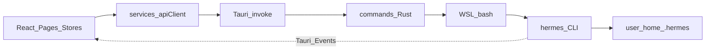
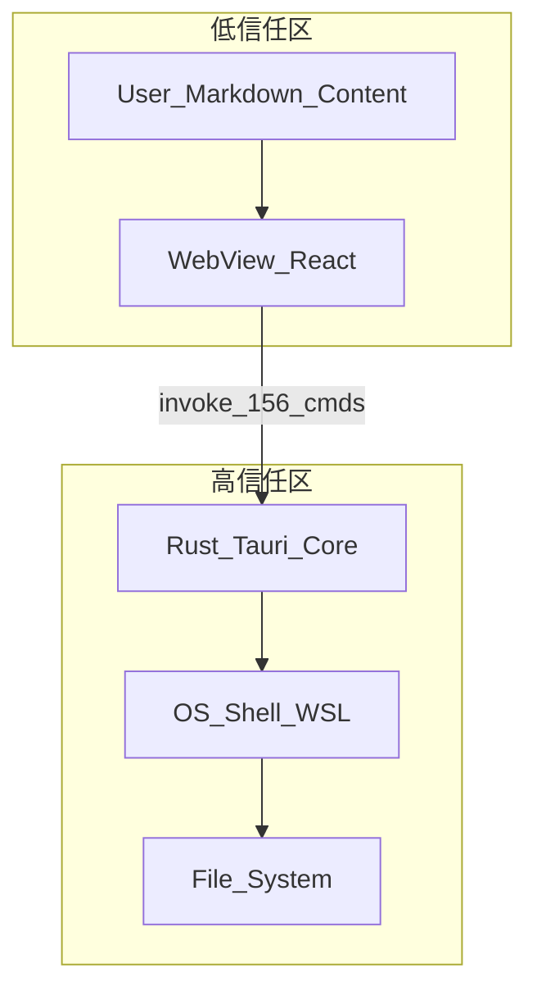

# Hermes Computer Use — 项目审核审计报告

| 字段 | 内容 |
|------|------|
| **项目名称** | Hermes Computer Use (`hermes-computer-use`) |
| **应用版本** | 0.1.1 |
| **审计日期** | 2026-05-15 |
| **审计范围** | `hermes-app/` 全栈（React 前端、Tauri 2 Rust 后端、CI、依赖、Hermes Agent 集成） |
| **审计方法** | 静态代码审查、配置与权限分析、测试与 CI 清单核对；未执行运行时渗透测试 |
| **报告类型** | 综合安全与质量审计（非渗透测试报告） |

---

## 1. 执行摘要

Hermes Computer Use 是基于 **Tauri 2 + React 19** 的桌面管理控制台，通过 IPC 调用 Rust 命令，再经 **WSL/bash** 驱动本机 **Hermes Agent**。整体功能较完整，前端 Store 层单元测试覆盖尚可，但存在**密钥管理严重风险**、**IPC/Shell 攻击面偏大**、**Rust 与 UI 层测试空白**、**CI 无质量门禁**等问题。

### 1.1 综合评级

| 领域 | 评级 | 摘要 |
|------|------|------|
| 密钥与配置管理 | **严重** | 仓库内存在含真实密钥的 Hermes 本地配置，且未在 `.gitignore` 中排除 |
| 安全架构 | **高** | 约 156 个 IPC 命令对 WebView 几乎无细粒度授权；Shell/文件/工具调用权限过高 |
| 单元测试（前端 Store） | **中** | 14/17 个 Store 有 Vitest 覆盖 |
| 单元测试（Rust / UI / 流式） | **低** | 无 Rust 测试、无页面/组件/E2E 测试 |
| CI 质量门禁 | **低** | 仅 tag 触发的多平台发布构建，无 lint/test 流水线 |
| 依赖与供应链 | **中高** | `package-lock.json` / `Cargo.lock` 已提交；Cargo 版本声明偏松 |
| Hermes 功能集成 | **中** | 核心对接约 75%，MCP/Gateway 等仍有缺口（详见第九节） |

### 1.2 Top 5 风险

1. **密钥泄露**：`src-tauri/~/.hermes/config.yaml` 含模型 API 密钥、服务端密钥等敏感字段，且路径未被 `.gitignore` 忽略。
2. **工具任意调用**：`invoke_tool` 对参数无 schema 校验，前端可通过 IPC 触发 Hermes 内置工具（含终端、写文件等）。
3. **文件访问范围过大**：文件类 IPC 允许 `~`、`/home/`、`/mnt/` 等路径；WSL 下 `/mnt/` 可映射整台 Windows 磁盘。
4. **信任边界薄弱**：任意 WebView 内 XSS 或恶意脚本理论上可调用全部 IPC（含 `execute_skill`、网关控制、MCP 子进程启动）。
5. **生产调试面**：`tauri.conf.json` 与 Cargo `devtools` feature 在生产构建中仍可能启用开发者工具。

### 1.3 建议后续验证命令

审计阶段未执行以下命令，建议在整改后定期运行：

```bash
npm run lint
npm test
npm run build
npm audit
cd src-tauri && cargo audit
```

---

## 2. 项目概览

### 2.1 产品定位

[Hermes Computer Use](https://github.com/Crown-22/Hermes-Computer-Use) 是 [Hermes Agent](https://github.com/hermes-agent/hermes) 的桌面管理控制台，提供仪表盘、会话、技能、定时任务、记忆、多平台网关、文件浏览、监控与聊天等能力。

### 2.2 技术栈

| 层级 | 技术 | 版本（声明 / 锁定） |
|------|------|---------------------|
| UI | React | ^19.1.0 |
| 语言 | TypeScript | ~5.8.3 |
| 构建 | Vite | 7.0.4（精确） |
| 状态 | Zustand | ^5.0.12 |
| 桌面壳 | Tauri | 2.x（lock: 2.11.1） |
| 后端 | Rust | edition 2021 |
| 测试 | Vitest | ^4.1.5 |
| 许可证 | MIT | — |

### 2.3 目录结构（摘要）

```
hermes-app/
├── src/                 # React 前端（pages、components、stores、services）
├── src-tauri/           # Tauri Rust 后端（commands、features、hermes_adapter）
├── public/              # 静态资源
├── .github/workflows/   # CI（仅 release）
├── package.json
└── vitest.config.ts
```

### 2.4 核心功能模块

| 模块 | 前端路径 | 后端命令模块 |
|------|----------|--------------|
| 仪表盘 | `src/pages/Dashboard/` | `system.rs` |
| 会话 | `src/pages/Sessions/` | `sessions.rs` |
| 聊天 | `src/pages/Chat/`、`SessionChat` | `chat.rs` |
| 技能 | `src/pages/Skills/` | `skills.rs` |
| 定时任务 | `src/pages/CronJobs/` | `cron_jobs.rs` |
| 记忆 | `src/pages/Memory/` | `memories.rs` |
| 平台 | `src/pages/Platforms/` | `platforms.rs` |
| 文件 | `src/pages/Files/` | `files.rs` |
| 监控 | `src/pages/Monitor/` | `monitor.rs`、`logs.rs` |
| 设置 | `src/pages/Settings/` | `config.rs`、`profiles.rs` |
| MCP | `src/pages/MCP/` | `mcp.rs` |
| 看板 | `src/pages/Kanban/` | `kanban.rs` |
| 工具 | 聊天/工具卡片 | `tools.rs` |

---

## 3. 系统架构

### 3.1 数据流



### 3.2 分层职责

| 层级 | 关键文件 | 职责 |
|------|----------|------|
| UI | `src/pages/*`、`src/components/*` | 页面与交互 |
| 状态 | `src/stores/*` | Zustand 全局状态 |
| 服务 | `src/services/apiClient.ts`、`src/lib/tauri.ts` | IPC 封装、超时重试、错误分类 |
| 流式聊天 | `src/services/hermesChat.ts` | 事件订阅 + `stream_chat_realtime` |
| Tauri | `src-tauri/src/lib.rs` | 注册约 **156** 个 `invoke` 命令 |
| Shell | `src-tauri/src/commands/utils.rs` | Windows → WSL，其余 → bash |
| Agent | `hermes` CLI、`stream_agent.py` | 推理、工具、网关 |
| 数据 | `~/.hermes/` | 配置、会话 DB、密钥响应文件等 |

### 3.3 IPC 设计特点

- **单一通信面**：业务几乎全部经 `invoke(cmd, args)`，无独立 REST BFF。
- **Windows 中心**：大量命令通过 `wsl bash -c` 访问 Linux 侧 Hermes 环境。
- **事件回传**：聊天流式输出经 `chat:chunk`、`chat:complete` 等 Tauri 事件推送至 WebView。
- **密钥/审批通道**：`respond_secret` / `respond_approval` 等将用户输入写入 `~/.hermes/secrets|approvals/*.response`，由 Agent 子进程轮询消费。

### 3.4 架构风险

| 问题 | 说明 |
|------|------|
| 缺少统一 CLI 适配层 | 各模块分别访问 SQLite、YAML、JSON、Python 脚本，维护成本高 |
| 数据一致性 | 部分路径绕过 Hermes Agent 官方数据管理（如直接查 SQLite） |
| 跨平台不一致 | `chat.rs` 中部分 `respond_*` 硬编码 `wsl`，与 `utils::run_shell_command` 抽象不一致 |

---

## 4. 安全审计

### 4.1 发现清单（按严重度）

| 级别 | ID | 发现 | 位置 | 建议 |
|------|-----|------|------|------|
| **严重** | SEC-01 | 仓库内存在含**真实 API 密钥**的 Hermes 配置文件（含 `api_key`、`API_SERVER_KEY` 等字段） | `src-tauri/~/.hermes/config.yaml` | 立即轮换密钥；从 Git 历史清除；加入 `.gitignore`；仅提交 `config.yaml.example` |
| **严重** | SEC-02 | `.gitignore` 未排除 `**/.hermes/`、`src-tauri/~/` | `.gitignore` | 增加忽略规则，防止再次误提交 |
| **高** | SEC-03 | `invoke_tool` 对 `args` 无 schema 校验，直接调用工具 handler | `src-tauri/src/commands/tools.rs` | 工具白名单 + 用户审批 gate |
| **高** | SEC-04 | 文件 IPC 允许 `/mnt/` 等宽路径 | `src-tauri/src/commands/files.rs` | 限制为工作区根 + `~/.hermes` |
| **高** | SEC-05 | 约 156 个 IPC 对前端无分组授权；`opener`/`process` 插件已启用 | `src-tauri/capabilities/default.json` | Capability 最小权限；按功能拆分窗口权限 |
| **中** | SEC-06 | 生产构建可能启用 DevTools | `tauri.conf.json`、`Cargo.toml` `devtools` feature | 发布构建关闭 devtools |
| **中** | SEC-07 | CSP 含 `style-src 'unsafe-inline'`；`connect-src` 允许 localhost 任意端口 | `src-tauri/tauri.conf.json` | 收紧 CSP；评估 nonce/hash |
| **中** | SEC-08 | Markdown 渲染未过滤 `javascript:` 等危险 scheme | `src/components/ui/MarkdownRenderer/MarkdownRenderer.tsx` | 链接/图片 scheme 白名单 |
| **中** | SEC-09 | `respond_approval/clarify/secret` 硬编码 WSL | `src-tauri/src/commands/chat.rs` | 统一使用 `run_shell_command` |
| **中** | SEC-10 | `get_wsl_config_path()` 硬编码 Canonical Ubuntu 路径 | `src-tauri/src/commands/config.rs` | 动态解析 WSL 用户目录 |
| **中** | SEC-11 | MCP 可 spawn 用户配置的 server 命令 | `src-tauri/src/commands/mcp.rs` | 配置校验 + 命令白名单 |
| **低** | SEC-12 | `loadConfig` 失败静默返回 `{}` | `src/services/settingsApi.ts` | 区分「空配置」与「加载失败」 |
| **低** | SEC-13 | 浏览器 dev 模式 mock 数据可能掩盖权限问题 | `src/lib/tauri.ts` | 开发环境明确提示 mock 范围 |
| **信息** | SEC-14 | `jszip` 处理用户 ZIP 时需防 Zip Slip | `src/services/filesApi.ts` 等 | 路径规范化 + 测试用例 |

> **说明**：本报告不记录任何密钥明文。若该配置文件曾推送到远程仓库，应按 P0 流程轮换并清理 Git 历史（`git filter-repo` / BFG）。

### 4.2 正面安全实践

| 实践 | 位置 |
|------|------|
| API Key 掩码（`__MASKED__` + 末 4 位预览）及保存时剥离 | `src-tauri/src/commands/config.rs` |
| `respond_secret` 使用 base64 编码 payload，并对 `secret_id` 校验 | `src-tauri/src/commands/chat.rs` |
| 文件路径拒绝 `..` 遍历及 `;|$\`` 等 shell 元字符 | `src-tauri/src/commands/files.rs` |
| 前端未发现 `eval`、`dangerouslySetInnerHTML` | `src/` 全目录检索 |
| CSP `script-src 'self'` | `src-tauri/tauri.conf.json` |
| 会话查询使用参数化 SQL（防注入） | `src-tauri/src/commands/sessions.rs` |

### 4.3 API Key 掩码机制（代码参考）

```rust
// src-tauri/src/commands/config.rs
fn mask_api_key(key: &str) -> String {
    if key.len() <= 4 {
        return "__MASKED__".to_string();
    }
    let visible = &key[key.len() - 4..];
    format!("__MASKED__{}", visible)
}

fn is_masked_api_key(value: &str) -> bool {
    value.starts_with("__MASKED__")
        || value.starts_with('\u{2022}')
        // ...
}
```

### 4.4 Tauri 权限与 CSP

**Capabilities**（`src-tauri/capabilities/default.json`）：

- `core:default` + 窗口操作
- `opener:default` — 可打开外部 URL
- `process:default` — 进程插件
- `window-state:default`

**CSP 摘要**（`tauri.conf.json`）：

- `default-src 'self'`
- `connect-src` 含 `http://localhost:*`、`http://127.0.0.1:*`、`http://ipc.localhost`
- `img-src` 含 `https:`（可加载任意外部图片，存在隐私/追踪风险）

### 4.5 信任边界分析



当前模型将 **WebView 与 Rust 同进程、宽 IPC**，一旦 Markdown/XSS 突破渲染层，即可向 Rust 请求高权限操作。纵深防御应依赖：CSP、Markdown 消毒、IPC 白名单、敏感操作二次确认。

---

## 5. 代码质量与最佳实践

### 5.1 错误处理

| 层级 | 模式 | 评价 |
|------|------|------|
| 前端 IPC | `HermesApiError` + `classifyErrorCode`；`ApiClient` 对 `not_found`/`validation`/`permission` 不重试 | 良好 |
| 前端业务 API | 部分 `catch` 后返回 `{}` / `[]` | 可用性高，易掩盖故障 |
| Rust commands | 多数 `Result<T, String>` | 简单，不利于结构化日志 |
| Rust core | `HermesError` 枚举（`core/errors.rs`）存在但未全面采用 | 架构与实现脱节 |

### 5.1 ESLint 与类型

- `package.json` 提供 `npm run lint`（ESLint 9 + typescript-eslint 8）。
- `npm run build` 含 `tsc && vite build`，类型检查纳入构建。
- **CONTRIBUTING.md** 提及 Prettier，但 `package.json` **未配置** Prettier — 文档与工具链不一致。

### 5.2 文档一致性

| 项 | 问题 |
|----|------|
| CONTRIBUTING 克隆 URL | 指向 `Crown-22/hermes-console`，与 `package.json` 的 `Hermes-Computer-Use` 不一致 |
| CHANGELOG | 已维护 0.1.0 / 0.1.1；与当前版本一致 |
| README | 结构清晰；环境变量示例完整 |

### 5.3 代码质量评分（主观）

| 维度 | 评分（1–10） | 说明 |
|------|-------------|------|
| 可读性与模块划分 | 7 | 前后端模块清晰，命令按域拆分 |
| 类型安全 | 7 | TS 覆盖较好；Rust 错误类型未统一 |
| 安全性 | 4 | 密钥与 IPC 面是主要扣分项 |
| 可测试性 | 5 | Store 可测；Rust/流式/UI 难测 |
| 可维护性 | 6 | 多数据源访问方式增加维护成本 |
| **综合** | **5.8** | 功能完整但安全与测试需加强 |

---

## 6. 测试与质量保障

### 6.1 现状统计

| 指标 | 数值 |
|------|------|
| Vitest 测试文件 | **21** |
| 测试框架 | Vitest 4.1.5 + jsdom |
| 运行命令 | `npm test` → `vitest run` |
| 覆盖率配置 | **无**（未配置阈值或 CI 上报） |
| Rust `#[test]` | **0** |
| E2E / 组件测试 | **0** |

### 6.2 已覆盖模块

| 类别 | 已测 / 总数 | 已测文件 |
|------|-------------|----------|
| **Stores** | 14 / 17 | `chatStore`, `sessionStore`, `settingsStore`, `themeStore`, `dashboardStore`, `filesStore`, `memoryStore`, `skillsStore`, `cronJobsStore`, `kanbanStore`, `monitorStore`, `navigationStore`, `toastStore`, `hermesReadinessStore`, `platformStore` |
| **Services** | 3 / ~22 | `apiClient`, `sessionApi`, `updateApi` |
| **Lib** | 1 / ~9 | `errorUtils` |
| **Hooks** | 1 / ~7 | `useHermesReadiness` |
| **Utils** | 1 / 2 | `validation` |

### 6.3 未覆盖（按优先级）

| 优先级 | 模块 | 风险 |
|--------|------|------|
| P0 | `hermesChat.ts` 流式/事件 | 核心聊天路径无回归保护 |
| P0 | `config.rs` 掩码与保存逻辑 | 密钥误覆盖风险 |
| P1 | `files.rs` 路径校验 | 路径穿越与宽范围访问 |
| P1 | `tools.rs` / `invoke_tool` | 任意工具调用 |
| P1 | `parseToolJson`、Markdown 渲染 | XSS / 解析错误 |
| P2 | `mcpStore`, `profilesStore`, `hermesEnvironmentStore` | 状态逻辑未测 |
| P2 | 全部 `src/pages/*` | UI 回归无自动化 |
| P3 | `src-tauri/**` 全量 Rust | 后端零测试 |

### 6.4 测试基础设施

- Setup：`src/test/setup.ts`（localStorage、Notification mock）
- Tauri mock：`src/test/mocks/tauri.ts`
- 测试中使用 `sk-test` 等占位符（`useHermesReadiness.test.ts`）— 属正常做法

---

## 7. 依赖与供应链

### 7.1 前端依赖（`package.json`）

| 依赖 | 版本 | 审计备注 |
|------|------|----------|
| react / react-dom | ^19.1.0 | 主版本较新，需跟踪 CVE |
| @tauri-apps/api | ^2.11.0 | 与 Rust 侧 Tauri 2.11 对齐 |
| vite | 7.0.4（精确） | 利于可复现构建 |
| jszip | ^3.10.1 | 注意 Zip Slip |
| react-markdown + remark-gfm | ^10 / ^4 | 不可信 Markdown 需防 XSS |
| rehype-highlight | ^7.0.2 | 注意 HTML 输出上下文 |
| zustand | ^5.0.12 | 低风险 |

`package-lock.json` 已提交；部分包可能从 `registry.npmmirror.com` 解析 — 组织内应明确镜像策略。

### 7.2 Rust 依赖（`src-tauri/Cargo.toml`）

| 依赖 | 审计备注 |
|------|----------|
| tauri + `devtools`, `tray-icon` | 发布版应评估关闭 devtools |
| reqwest 0.12（blocking, native-tls） | 注意 SSRF 与证书校验 |
| serde_yaml 0.9 | YAML 反序列化面需限制来源 |
| tokio 1.x | 标准异步运行时 |
| 其他 | base64, uuid, regex, fs2, dirs, chrono |

`Cargo.lock` 已提交（良好实践）；`Cargo.toml` 中部分依赖使用宽松主版本号，靠 lock 固定。

### 7.3 供应链建议

- 引入 Dependabot / Renovate 或定期 `npm audit` / `cargo audit`
- 发布前在 CI 中运行审计命令并阻断高危 CVE
- 对 `jszip`、Markdown 渲染增加安全向单元测试

---

## 8. CI/CD 与发布流程

### 8.1 现有流水线

| 文件 | 触发 | 行为 |
|------|------|------|
| `.github/workflows/release.yml` | `push` tag `v*`；`workflow_dispatch` | macOS / Ubuntu 22.04 / Windows 矩阵构建；`tauri-action` 创建 **draft** Release |

### 8.2 缺失项

- 无 `pull_request` / `push` 上的 `npm run lint`、`npm test`、`tsc` 门禁
- 无 Dependabot / `cargo-audit` 工作流
- 无代码覆盖率上报
- Release 需人工发布 draft

### 8.3 Issue 模板

- `.github/ISSUE_TEMPLATE/bug_report.md`
- `.github/ISSUE_TEMPLATE/feature_request.md`

---

## 9. Hermes Agent 集成完成度

> 详细功能矩阵、架构问题与模块级分析见：  
> [`.kiro/specs/hermes-agent-integration-audit/audit-report.md`](.kiro/specs/hermes-agent-integration-audit/audit-report.md)  
> （审核日期：2026-05-14）

### 9.1 摘要

整体 Hermes Agent 对接完成度约 **75%**。聊天、会话、技能、配置、定时任务、记忆、工具调用等核心路径已实现；MCP 运行时控制、Gateway 进程管理、API Server、语音模式等仍有明显缺口。

### 9.2 模块完成度（摘自集成审计）

| 模块 | 完整度 | 状态 | 关键问题 |
|------|--------|------|---------|
| Chat | 95% | 优秀 | 缺少语音模式 |
| Config | 90% | 良好 | 缺少配置验证 |
| Sessions | 85% | 良好 | Checkpoint 能力有限 |
| Skills | 80% | 可用 | 缺少改进/部分执行能力 |
| Cron Jobs | 90% | 良好 | 功能较完整 |
| Memory | 85% | 良好 | 缺少自动清理 |
| MCP | 40% | 不完整 | 仅配置管理，运行时弱 |
| Platform Gateway | 50% | 不完整 | 无完整进程控制 |
| Tools | 90% | 良好 | IPC 安全需加强 |
| System | 80% | 良好 | 实时监控可加强 |

### 9.3 已实现亮点

- 流式聊天 + 完整事件（token、reasoning、tool、approval、clarify、secret）
- 会话 SQLite 查询 + 参数化防注入
- YAML 配置 CRUD + API Key 掩码
- MCP 配置 CRUD（运行时控制仍不足）

### 9.4 主要缺口

- OpenAI 兼容 API Server 端点
- Voice Mode
- Context Files 项目管理
- Terminal Backends（Docker、SSH、Daytona）
- 统一 Hermes CLI 调用层（当前多模块各自访问数据）

---

## 10. 整改建议路线图

### P0 — 立即（0–3 天）

| # | 行动 | 关联 ID |
|---|------|---------|
| 1 | 轮换 `config.yaml` 中已暴露的所有 API 密钥与 `API_SERVER_KEY` | SEC-01 |
| 2 | 从 Git 跟踪中移除 `src-tauri/~/.hermes/`，并清理远程历史（若已推送） | SEC-01 |
| 3 | 更新 `.gitignore`：`**/.hermes/`、`src-tauri/~/` | SEC-02 |
| 4 | 新增 `config.yaml.example`（仅占位符，无真实密钥） | SEC-01 |

### P1 — 短期（1–2 周）

| # | 行动 | 关联 ID |
|---|------|---------|
| 5 | `invoke_tool` 增加白名单或强制走用户审批流 | SEC-03 |
| 6 | 收窄 `files` IPC 允许路径 | SEC-04 |
| 7 | CI 增加：`npm run lint`、`npm test`、`npm run build` | §8 |
| 8 | 为 `config` 掩码、`validate_path` 添加单元测试 | §6 |

### P2 — 中期（2–4 周）

| # | 行动 | 关联 ID |
|---|------|---------|
| 9 | 发布构建关闭 `devtools`（feature + `tauri.conf.json`） | SEC-06 |
| 10 | Markdown 链接/图片 scheme 白名单 | SEC-08 |
| 11 | 统一 `respond_*` 使用 `run_shell_command` | SEC-09 |
| 12 | 配置 Vitest coverage 阈值（建议 stores ≥ 80%） | §6 |
| 13 | 补充 `hermesChat`、MCP、平台 API 测试 | §6 |

### P3 — 长期（1–3 月）

| # | 行动 | 关联 ID |
|---|------|---------|
| 14 | Tauri Capability 按命令域分组、最小权限 | SEC-05 |
| 15 | Rust 采用 `HermesError` 结构化错误并全面 `#[cfg(test)]` | §5 |
| 16 | 建立统一 `hermes_cli` 适配层 | §9 |
| 17 | 定期 `npm audit` / `cargo audit` 接入 CI | §7 |
| 18 | 修正 CONTRIBUTING 仓库 URL 与 Prettier 说明 | §5 |

---

## 附录 A：审计文件清单

本次审计重点阅读或检索的文件（约 30+）：

| 路径 | 用途 |
|------|------|
| `package.json` | 依赖与脚本 |
| `vitest.config.ts` | 测试配置 |
| `.gitignore` | 敏感路径排除 |
| `src/services/apiClient.ts` | IPC 客户端 |
| `src/lib/tauri.ts` | safeInvoke、错误分类 |
| `src/services/hermesChat.ts` | 流式聊天 |
| `src/services/settingsApi.ts` | 配置 API |
| `src/services/filesApi.ts` | 文件 API |
| `src/services/toolsApi.ts` | 工具调用 |
| `src/components/ui/MarkdownRenderer/MarkdownRenderer.tsx` | Markdown 渲染 |
| `src-tauri/src/lib.rs` | IPC 命令注册 |
| `src-tauri/tauri.conf.json` | CSP、窗口、devtools |
| `src-tauri/capabilities/default.json` | Tauri 权限 |
| `src-tauri/Cargo.toml` | Rust 依赖 |
| `src-tauri/src/commands/config.rs` | 配置与掩码 |
| `src-tauri/src/commands/chat.rs` | 聊天与 respond_* |
| `src-tauri/src/commands/files.rs` | 文件访问 |
| `src-tauri/src/commands/tools.rs` | invoke_tool |
| `src-tauri/src/commands/utils.rs` | Shell 桥接 |
| `src-tauri/src/commands/sessions.rs` | 会话 DB |
| `src-tauri/src/commands/mcp.rs` | MCP |
| `src-tauri/src/commands/platforms.rs` | 平台网关 |
| `src-tauri/src/core/errors.rs` | 错误枚举 |
| `src-tauri/~/.hermes/config.yaml` | **敏感配置（不应入库）** |
| `.github/workflows/release.yml` | CI 发布 |
| `CONTRIBUTING.md` | 贡献指南 |
| `CHANGELOG.md` | 变更日志 |
| `.kiro/specs/hermes-agent-integration-audit/audit-report.md` | 集成审计 |

---

## 附录 B：Tauri IPC 命令模块统计

在 `src-tauri/src/lib.rs` 的 `generate_handler!` 中注册约 **156** 个命令。按源文件 `pub fn` 数量估算分布如下：

| 模块文件 | 约命令数 | 主要能力 |
|----------|----------|----------|
| `commands/sessions.rs` | 19 | 会话 CRUD、搜索、导出、Checkpoint |
| `commands/kanban.rs` | 17 | 看板与任务 |
| `commands/skills.rs` | 14 | 技能 CRUD、执行 |
| `commands/platforms.rs` | 13 | 多平台网关 |
| `commands/chat.rs` | 13 | 流式聊天、审批/密钥响应 |
| `commands/files.rs` | 12 | 文件读写、树、搜索 |
| `commands/mcp.rs` | 12 | MCP 配置与运行时 |
| `commands/utils.rs` | 11 | Shell、环境工具 |
| `commands/cron_jobs.rs` | 10 | 定时任务 |
| `commands/profiles.rs` | 10 | Agent Profile |
| `commands/config.rs` | 9 | YAML 配置 |
| `commands/monitor.rs` | 7 | 监控指标 |
| `commands/memories.rs` | 6 | 长期记忆 |
| `commands/tools.rs` | 4 | 工具列表与 invoke |
| `commands/system.rs` | 4 | 系统状态 |
| `commands/logs.rs` | 3 | 日志 |
| `hermes_adapter/environment.rs` | 4 | 环境与能力检测 |
| **合计（约）** | **156+** | 注册于 `lib.rs` |

---

## 附录 C：修订记录

| 版本 | 日期 | 说明 |
|------|------|------|
| 1.0 | 2026-05-15 | 首版综合审计报告 |

---

*本报告由静态代码审计生成，不构成法律或合规认证。实施 P0 整改前请勿将含密钥的配置文件继续提交至版本控制。*
