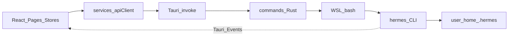
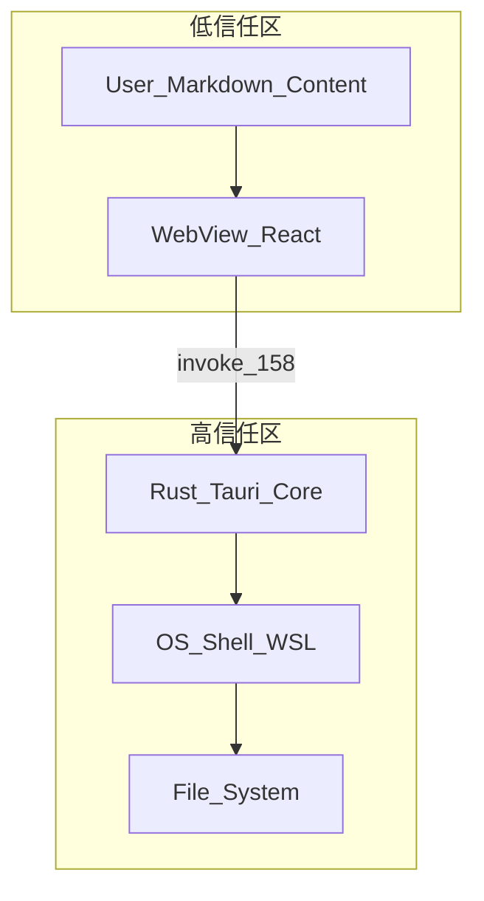

# Hermes Computer Use — 项目审核审计报告

| 字段 | 内容 |
|------|------|
| **项目名称** | Hermes Computer Use (`hermes-computer-use`) |
| **应用版本** | 0.1.1 |
| **报告版本** | 2.0 |
| **审计日期** | 2026-05-16（结构化复审 · 对照当前代码库与 CI） |
| **审计范围** | `hermes-app/` 全栈（React 前端、Tauri 2 Rust 后端、CI、依赖、Hermes Agent 集成） |
| **审计方法** | 静态代码审查、配置与权限分析、测试与 CI 清单核对；未执行运行时渗透测试 |
| **报告类型** | 综合安全与质量审计（第二次结构化复审 · 非渗透测试报告） |

### 目录

| 节 | 标题 |
|----|------|
| [1](#1-执行摘要) | 执行摘要 |
| [2](#2-项目概览) | 项目概览 |
| [3](#3-系统架构) | 系统架构 |
| [4](#4-安全审计) | 安全审计 |
| [5](#5-代码质量与最佳实践) | 代码质量 |
| [6](#6-测试与质量保障) | 测试 |
| [7](#7-依赖与供应链) | 依赖 |
| [8](#8-cicd-与发布流程) | CI/CD |
| [9](#9-hermes-agent-集成完成度) | Hermes 集成 |
| [10](#10-整改路线图) | 整改路线图 |
| [附录](#附录-a审计文件清单) | 附录 A–C |

---

## 1. 执行摘要

Hermes Computer Use 是基于 **Tauri 2 + React 19** 的桌面管理控制台，通过 IPC 调用 Rust 命令，再经 **WSL/bash** 驱动本机 **Hermes Agent**。**复审结论（2026-05-16）**：路线图中 **P2/P3 整改项均已闭环**（Capabilities、统一 `HermesCli`、stores 覆盖率门槛 80%、冗余 IPC 收敛等）。Agent 功能对接维持约 **86–89%**（主路径已接 IPC；Chat 在应用内已达 **100%** 见 §9.1；个别命令仅后端注册、前端未调用）。**残余关注**：P0 **#2 远程 Git 历史强制推送与协作者协作**；**自定义 invoke 仍默认可从主 WebView 调用**（逐项 ACL 为长期项）；**页面/组件/E2E 测试仍为 0**；以及 **CSP 其余宽松项与用户生成内容链路**（见 SEC-07，含 Markdown 外链策略）等。

### 1.1 综合评级

| 领域 | 评级 | 摘要 |
|------|------|------|
| 密钥与配置管理 | **严重** | 历史提交中可能含真实密钥；`.gitignore` 已排除 `.hermes/`，仍需轮换密钥并清理 Git 历史 |
| 安全架构 | **高** | **158** 条 `invoke`（`lib.rs` 中逐项计数）+ 默认可调用面；已通过 **Capabilities 拆分**、`invoke_tool`/文件路径等专项收敛；**invoke 逐项 ACL** 仍为长期项 |
| 单元测试（前端 Store） | **中** | **17/17** Store 有 Vitest；`src/stores/**` 行/语句 **≥80%**（`vitest.config` 硬性阈值）；含 `chatPersistence` 等 |
| 单元测试（Rust / UI / 流式） | **中** | Rust **`cargo test --lib`**：`config`/`files`/`path_policy`/`tools`/`mcp`/`cli_bridge`/`errors` 等；**无页面/组件/E2E** |
| CI 质量门禁 | **中偏高** | `lint` → **`test:coverage`（含 stores 阈值）** → `build` → `npm audit --audit-level=high`；`cargo test --lib` + `cargo audit`（均失败即阻断） |
| 依赖与供应链 | **中高** | `package-lock.json` / `Cargo.lock` 已提交；Cargo 版本声明偏松 |
| Hermes 功能集成 | **良好** | 核心对接约 **86–89%**；Chat 流式/中断在应用内已闭环（§9.1）；平台收件箱、`HermesCli`/`execute_sync` 与技能 `dry_run` 等已落地；仍存在仅后端注册的 IPC（如 **`export_logs`**）与历史 Python/壳层路径（详见第九节） |

### 1.2 Top 5 风险

1. **密钥泄露**：`src-tauri/~/.hermes/config.yaml` 等路径曾可能含真实 API 密钥；**.gitignore 已排除** `.hermes/` 与 `src-tauri/~/`，但若曾推送远程仍需轮换并清历史。
2. **工具调用面**：`invoke_tool` 已有注册表与阻断列表，但仍缺完整 schema 审批门（见 SEC-03、路线图 #5）。
3. **文件访问面**：已引入 `path_policy`（`~/.hermes`、工作区等），宽 `~` 与 WSL 磁盘映射风险仍需评估（见 SEC-04、路线图 #6）。
4. **信任边界薄弱**：任意 WebView 内 XSS 或恶意脚本理论上可调用全部 IPC（含 `execute_skill`、网关控制、MCP 子进程启动）。
5. **生产调试面（已减轻）**：`tauri.conf.json` 中 **`devtools`: false**；**release 编译若误开 `devtools` feature 会 `compile_error`**（仍勿在流水线中为非调试构建启用该 feature）。

### 1.3 建议后续验证命令

审计阶段未执行以下命令，建议在整改后定期运行：

```bash
npm run lint
npm run test:coverage    # CI 同款；含 src/stores 覆盖率阈值
npm run build
npm audit
cd src-tauri && cargo test --lib && cargo audit
```

---

## 2. 项目概览

### 2.1 产品定位

[Hermes Computer Use](https://github.com/Crown-22/Hermes-Computer-Use) 是 [Hermes Agent](https://github.com/hermes-agent/hermes) 的桌面管理控制台，提供仪表盘、会话、技能、定时任务、记忆、多平台网关、文件浏览、监控与聊天等能力。

### 2.2 技术栈

| 层级 | 技术 | 版本（声明 / 锁定） |
|------|------|---------------------|
| UI | React | ^19.1.0 |
| 语言 | TypeScript | ~5.8.3 |
| 构建 | Vite | 7.0.4（精确） |
| 状态 | Zustand | ^5.0.12 |
| 桌面壳 | Tauri | 2.x（lock: 2.11.1） |
| 后端 | Rust | edition 2021 |
| 测试 | Vitest | ^4.1.5 |
| 许可证 | MIT | — |

### 2.3 目录结构（摘要）

```
hermes-app/
├── src/                 # React 前端（pages、components、stores、services）
├── src-tauri/           # Tauri Rust 后端（commands、features、hermes_adapter）
├── public/              # 静态资源
├── .github/workflows/   # CI（ci.yml + release.yml）
├── package.json
└── vitest.config.ts
```

### 2.4 核心功能模块

| 模块 | 前端路径 | 后端命令模块 |
|------|----------|--------------|
| 仪表盘 | `src/pages/Dashboard/` | `system.rs` |
| 会话 | `src/pages/Sessions/` | `sessions.rs` |
| 聊天 | `src/pages/Chat/`（主路径） | `chat.rs` |
| 网关 | `src/pages/Gateway/` | `monitor.rs`（状态）+ `GatewayManager`（启停） |
| 技能 | `src/pages/Skills/` | `skills.rs` |
| 定时任务 | `src/pages/CronJobs/` | `cron_jobs.rs` |
| 记忆 | `src/pages/Memory/` | `memories.rs` |
| 平台 | `src/pages/Platforms/` | `platforms.rs` |
| 文件 | `src/pages/Files/` | `files.rs` |
| 监控 | `src/pages/Monitor/` | `monitor.rs`、`logs.rs` |
| 设置 | `src/pages/Settings/` | `config.rs`、`profiles.rs` |
| MCP | `src/pages/MCP/` | `mcp.rs` |
| 看板 | `src/pages/Kanban/` | `kanban.rs` |
| 工具 | 聊天/工具卡片 | `tools.rs` |

---

## 3. 系统架构

### 3.1 数据流



### 3.2 分层职责

| 层级 | 关键文件 | 职责 |
|------|----------|------|
| UI | `src/pages/*`、`src/components/*` | 页面与交互 |
| 状态 | `src/stores/*` | Zustand 全局状态 |
| 服务 | `src/services/apiClient.ts`、`src/lib/tauri.ts` | IPC 封装、超时重试、错误分类 |
| 流式聊天 | `src/services/hermesChat.ts` | 事件订阅 + `stream_chat_realtime` |
| 全局流式桥接 | `src/lib/chatStreamBridge.ts` | App 级监听 `chat:*`，切页仍更新 `chatStore` |
| Tauri | `src-tauri/src/lib.rs` | `generate_handler!` 中 **`158` 条** `invoke`（已移除冗余 `abort_chat`、`test_skill`；含 `register_chat_interrupt_alias`、环境与能力检测等） |
| Shell | `src-tauri/src/commands/utils.rs` | Windows → WSL，其余 → bash |
| Agent | `hermes` CLI、`stream_agent.py` | 推理、工具、网关 |
| 数据 | `~/.hermes/` | 配置、会话 DB、密钥响应文件等 |

### 3.3 IPC 设计特点

- **单一通信面**：业务几乎全部经 `invoke(cmd, args)`，无独立 REST BFF。
- **Windows 中心**：大量命令通过 `wsl bash -c` 访问 Linux 侧 Hermes 环境。
- **事件回传**：聊天流式输出经 `chat:chunk`、`chat:complete` 等 Tauri 事件推送至 WebView。
- **密钥/审批通道**：`respond_secret` / `respond_approval` 等将用户输入写入 `~/.hermes/secrets|approvals/*.response`，由 Agent 子进程轮询消费。

### 3.4 架构风险

| 问题 | 说明 |
|------|------|
| 统一 CLI 适配（部分化解） | `HermesCli` + `execute_sync` 已覆盖网关、MCP、`skills`、`platform connect/send`、`cron trigger` 等；**仍会**话的 SQLite、内嵌 Python、个别 `bash -c` 路径与 CLI 并存 |
| 数据一致性 | 部分路径绕过 Hermes Agent 官方数据管理（如直接查 SQLite） |
| 跨平台一致性 | Windows 上以 WSL 为主；个别 `respond_*` / 壳层路径与 `utils::run_shell_command` 仍存在不完全一致的历史代码 |

---

## 4. 安全审计

### 4.1 发现清单（按严重度）

| 级别 | ID | 发现 | 位置 | 路线图 | 整改状态 |
|------|-----|------|------|--------|----------|
| **严重** | SEC-01 | 仓库内曾可能存在含**真实 API 密钥**的配置（`api_key`、`API_SERVER_KEY` 等） | `src-tauri/~/.hermes/config.yaml` | #1–2、#4 | ✅ 密钥已轮换；🟡 本地历史已清，⏳ 强制推送远程 |
| **严重** | SEC-02 | `.gitignore` 未排除 Hermes 本地数据目录 | `.gitignore` | #3 | ✅ 已排除；⏳ 确认 Git 历史 |
| **高** | SEC-03 | `invoke_tool` 参数与审批不足 | `commands/tools.rs` | #5 | ✅ 阻断列表 + 片段过滤 + schema 校验 |
| **高** | SEC-04 | 文件 IPC 路径范围偏大 | `commands/files.rs` + `path_policy.rs` | #6 | ✅ 仅 `~/.hermes` + 工作区；拒绝 `/mnt` |
| **高** | SEC-05 | 158 条 IPC 仍未逐条 ACL；插件权限曾为宽集合 | `capabilities/default.json` + `plugins-minimal.json` | #19 | ✅ 核心 ACL 细分；插件最小集；`tauri.conf.json` 显式 capabilities |
| **中** | SEC-06 | 生产构建可能启用 DevTools | `tauri.conf.json`、`Cargo.toml` | #13 | ✅ 配置关闭 + release 编译防护 |
| **中** | SEC-07 | CSP：`unsafe-inline`、localhost 宽端口、`connect-src` 等；外链图已通过收紧 **`img-src`** 减轻一类风险 | `tauri.conf.json` | — | ⏳ 未单列路线图 |
| **中** | SEC-08 | Markdown 危险 URL scheme | `MarkdownRenderer.tsx` | #14 | ✅ `isSafeUrl` + image-only `data:` |
| **中** | SEC-09 | Shell 调用未完全统一 | `commands/utils.rs` | #15 | ✅ 进程/Shell 工具集中 |
| **中** | SEC-10 | WSL 配置路径硬编码 | `commands/config.rs` | — | ⏳ 见 §9.4 |
| **中** | SEC-11 | MCP 可 spawn 用户配置命令 | `commands/mcp.rs` | — | ⏳ 见 §9.4 |
| **低** | SEC-12 | `loadConfig` 失败静默返回 `{}` | `settingsApi.ts` | — | ⏳ |
| **低** | SEC-13 | 浏览器 dev mock 掩盖权限问题 | `lib/tauri.ts` | — | ⏳ |
| **信息** | SEC-14 | ZIP 解压 Zip Slip 风险 | `filesApi.ts` 等 | — | 🟡 有 `zipSafe` 测试 |

> **说明**：本报告不记录任何密钥明文。若该配置文件曾推送到远程仓库，应按 P0 流程轮换并清理 Git 历史（`git filter-repo` / BFG）。

### 4.2 正面安全实践

| 实践 | 位置 |
|------|------|
| API Key 掩码（`__MASKED__` + 末 4 位预览）及保存时剥离 | `src-tauri/src/commands/config.rs` |
| `respond_secret` 使用 base64 编码 payload，并对 `secret_id` 校验 | `src-tauri/src/commands/chat.rs` |
| 文件路径拒绝 `..` 遍历及 `;|$\`` 等 shell 元字符 | `src-tauri/src/commands/files.rs` |
| 前端未发现 `eval`、`dangerouslySetInnerHTML` | `src/` 全目录检索 |
| CSP `script-src 'self'` | `src-tauri/tauri.conf.json` |
| 会话查询使用参数化 SQL（防注入） | `src-tauri/src/commands/sessions.rs` |

### 4.3 API Key 掩码机制（代码参考）

```rust
// src-tauri/src/commands/config.rs
fn mask_api_key(key: &str) -> String {
    if key.len() <= 4 {
        return "__MASKED__".to_string();
    }
    let visible = &key[key.len() - 4..];
    format!("__MASKED__{}", visible)
}

fn is_masked_api_key(value: &str) -> bool {
    value.starts_with("__MASKED__")
        || value.starts_with('\u{2022}')
        // ...
}
```

### 4.4 Tauri 权限与 CSP

**Capabilities**（`src-tauri/tauri.conf.json` 中 `app.security.capabilities`: `default` + `plugins-minimal`）：

- **`default`**：`core:path|event|app|resources|menu|tray|webview:default` 与窗口细粒度 `allow-*`（不再使用整包 `core:default`）；`window-state:default`
- **`plugins-minimal`**：`opener:allow-open-url`、`process:allow-exit`、`process:allow-restart`（不授予 `*:default` 宽权限）

> 自定义 `invoke` 命令仍默认对主窗口开放；进一步 IPC 白名单需在 `build.rs` / ACL 权限中逐项收紧（长期项）。

**CSP 摘要**（`tauri.conf.json`）：

- `default-src 'self'`
- `connect-src` 含 `http://localhost:*`、`http://127.0.0.1:*`、`http://ipc.localhost` 及对应 `ws:`
- `img-src` 当前为 **`'self' data: blob:`**（已收紧 arbitrary `https:` 外链图；用户内容中的远程图需依赖 Markdown 组件策略）

### 4.5 信任边界分析



当前模型将 **WebView 与 Rust 同进程、宽 IPC**，一旦 Markdown/XSS 突破渲染层，即可向 Rust 请求高权限操作。纵深防御应依赖：CSP、Markdown 消毒、IPC 白名单、敏感操作二次确认。

---

## 5. 代码质量与最佳实践

### 5.1 错误处理

| 层级 | 模式 | 评价 |
|------|------|------|
| 前端 IPC | `HermesApiError` + `classifyErrorCode`；`ApiClient` 对 `not_found`/`validation`/`permission` 不重试 | 良好 |
| 前端业务 API | 部分 `catch` 后返回 `{}` / `[]` | 可用性高，易掩盖故障 |
| Rust commands | 多数 `Result<T, String>` | 简单；[`HermesError`](src-tauri/src/core/errors.rs) 已补充单测（code / Display / `String` 转换） |
| Rust core | `HermesError` + 单测；`HermesCli` / `cli_bridge` | 命令层仍以 `Result<T, String>` 为主；CLI 主路径已集中 |

### 5.2 ESLint 与类型

- `package.json` 提供 `npm run lint`（ESLint 9 + typescript-eslint 8）。
- `npm run build` 含 `tsc && vite build`，类型检查纳入构建。
- **CONTRIBUTING.md** 已对齐 `Hermes-Computer-Use` 仓库 URL，并写明未配置 Prettier、以 ESLint + 现有风格为准。

### 5.3 文档一致性

| 项 | 状态 |
|----|------|
| CONTRIBUTING 克隆 URL | **已对齐**：`Hermes-Computer-Use`，与 `package.json` repository 一致 |
| CHANGELOG | 已维护 0.1.0 / 0.1.1；与当前 `package.json` 版本 **0.1.1** 一致 |
| README | 结构清晰；环境变量示例完整 |

### 5.4 代码质量评分（主观）

| 维度 | 评分（1–10） | 说明 |
|------|-------------|------|
| 可读性与模块划分 | 7 | 前后端模块清晰，命令按域拆分 |
| 类型安全 | 7 | TS 覆盖较好；Rust 以 `HermesError`/`String` 混用为主，正在向核心路径收敛 |
| 安全性 | 4 | 密钥与 IPC 面是主要扣分项 |
| 可测试性 | 7 | Stores **≥80%**、`chatStreamBridge`/多服务具测；页面与 E2E 仍缺 |
| 可维护性 | 7 | 多数据源访问方式增加维护成本；已移除重复 `SessionChat` |
| **综合** | **6.5** | 质量门禁与存储层测试显著加强；信任边界与 UI 自动化仍为短板 |

---

## 6. 测试与质量保障

### 6.1 现状统计

| 指标 | 数值 |
|------|------|
| Vitest 测试文件 | **32**（`src/**/__tests__/**/*.test.ts(x)`） |
| 测试框架 | Vitest 4.1.5 + jsdom |
| 运行命令 | `npm test` / `npm run test:coverage`；CI 执行 **`test:coverage`** |
| 覆盖率配置 | **`src/stores/**`** 行/语句 **≥80%**、分支 **≥56%**、函数 **≥88%**（`vitest.config.ts`）；**无** Codecov 等上报 |
| Rust `#[test]` | **有**（`config`、`files`、`path_policy`、`tools`、`mcp`、`cli_bridge`、`errors` 等模块内 `#[cfg(test)]`） |
| E2E / 组件测试 | **0** |

### 6.2 已覆盖模块

| 类别 | 已测 / 总数 | 已测文件 |
|------|-------------|----------|
| **Stores** | 17 / 17 | 全覆盖；aggregate **≥80%** lines（`vitest` 阈值 80%） |
| **Services** | 6+ / ~22 | `apiClient`, `sessionApi`, `updateApi`, `hermesChat`, `mcpApi`, `platformApi` |
| **Lib** | 5+ / ~9 | `errorUtils`, `safeUrl`, `zipSafe`, `chatStreamBridge`, `ipcToolPolicy` |
| **Hooks** | 1 / ~7 | `useHermesReadiness` |
| **Utils** | 1 / 2 | `validation` |

### 6.3 未覆盖（按优先级）

| 优先级 | 模块 | 风险 |
|--------|------|------|
| P1 | `hermesChat.ts` 流式/事件 | 已有基础单测；缺真实 IPC 集成场景 |
| P1 | `files.rs` / `path_policy` | 已有单测；宽路径与 WSL 映射仍须人工回归 |
| P1 | `tools.rs` / `invoke_tool` | 白名单与 schema 已落地；新工具类型需持续维护 |
| P1 | `parseToolJson`、Markdown 渲染 | XSS / 解析错误；依赖渲染层与 `isSafeUrl` |
| P2 | Store **分支** 覆盖率 | 行/语句已门禁 80%；`branches` 阈值 56%，可继续 ratchet |
| P2 | 全部 `src/pages/*` | UI / E2E 仍为 0 |
| P3 | Rust 其余命令模块 | **非零覆盖**：配置/路径/MCP/错误等已测；会话/聊天/监控等大面仍缺 |

### 6.4 测试基础设施

- Setup：`src/test/setup.ts`（localStorage、Notification mock）
- Tauri mock：`src/test/mocks/tauri.ts`
- 测试中使用 `sk-test` 等占位符（`useHermesReadiness.test.ts`）— 属正常做法

---

## 7. 依赖与供应链

### 7.1 前端依赖（`package.json`）

| 依赖 | 版本 | 审计备注 |
|------|------|----------|
| react / react-dom | ^19.1.0 | 主版本较新，需跟踪 CVE |
| @tauri-apps/api | ^2.11.0 | 与 Rust 侧 Tauri 2.11 对齐 |
| vite | 7.0.4（精确） | 利于可复现构建 |
| jszip | ^3.10.1 | 注意 Zip Slip |
| react-markdown + remark-gfm | ^10 / ^4 | 不可信 Markdown 需防 XSS |
| rehype-highlight | ^7.0.2 | 注意 HTML 输出上下文 |
| zustand | ^5.0.12 | 低风险 |

`package-lock.json` 已提交；部分包可能从 `registry.npmmirror.com` 解析 — 组织内应明确镜像策略。

### 7.2 Rust 依赖（`src-tauri/Cargo.toml`）

| 依赖 | 审计备注 |
|------|----------|
| tauri + `devtools`, `tray-icon` | 发布版应评估关闭 devtools |
| reqwest 0.12（blocking, native-tls） | 注意 SSRF 与证书校验 |
| serde_yaml 0.9 | YAML 反序列化面需限制来源 |
| tokio 1.x | 标准异步运行时 |
| 其他 | base64, uuid, regex, fs2, dirs, chrono |

`Cargo.lock` 已提交（良好实践）；`Cargo.toml` 中部分依赖使用宽松主版本号，靠 lock 固定。

### 7.3 供应链建议

- 引入 Dependabot / Renovate 或定期 `npm audit` / `cargo audit`（CI 已强制 npm high+ 与 cargo audit）
- 对 `jszip`、Markdown 渲染增加安全向单元测试

---

## 8. CI/CD 与发布流程

### 8.1 现有流水线

| 文件 | 触发 | 行为 |
|------|------|------|
| `.github/workflows/ci.yml` | `push` / `pull_request` → `main`, `develop` | **frontend**：`npm ci` → `lint` → **`test:coverage`** → **`build`** → **`npm audit --audit-level=high`**（任一步失败即失败） |
| （同上 jobs） | 同上 | **rust-check**：`cargo test --lib`（`src-tauri`）→ `cargo audit` |
| `.github/workflows/release.yml` | `push` tag `v*`；`workflow_dispatch` | macOS / Ubuntu 22.04 / Windows 矩阵构建；`tauri-action` 创建 **draft** Release |

### 8.2 缺口与运维项

- **已具备**：前端 CI 运行 **`npm run test:coverage`**，并对 **`src/stores/**`** 施加覆盖率阈值（见 `vitest.config.ts`）。
- **仍缺**：全局前端覆盖率阈值、Codecov / 覆盖率artifact 上报、**组件与 E2E** 流水线。
- 无 Dependabot / Renovate 自动依赖 PR；`audit` 失败即阻断时需定期升级依赖化解。
- Release 仍为 **draft** Release，需维护者手动审发。

### 8.3 Issue 模板

- `.github/ISSUE_TEMPLATE/bug_report.md`
- `.github/ISSUE_TEMPLATE/feature_request.md`

---

## 9. Hermes Agent 集成完成度

**整体完成度：约 86–89%**（复审 2026-05-16；Chat 模块在应用内已按 **100%** 计，见 §9.1）。核心页面均走真实 IPC；个别命令仅存于后端注册清单。历史对照见 [集成审计（2026-05-14）](.kiro/specs/hermes-agent-integration-audit/audit-report.md)。

### 9.1 模块矩阵

| 模块 | 完整度 | 评级 | 要点 | 未达 100% 的主要原因 |
|------|--------|------|------|----------------------|
| Chat | **100%** | 优秀 | 全局 `chatStreamBridge`；切页不 abort；侧边栏指示；**`register_chat_interrupt_alias`（UUID 迁移后仍能 `interrupt_session`）**；Rust 全链路事件带 **`stream_session_key` 供前端按会话路由** | **—（应用内已无已知缺口）**；Hermes/Python/WSL 仍为**外部运行时依赖**；桌面 E2E 未建（见 §6） |
| Config | 92% | 良好 | API Key 掩码；后端 validate + 前端表单校验 | 配置节与 Hermes **全量** schema / 运行时并非一一对齐；校验与报错文案依赖本地 YAML 语义 |
| Sessions | 88% | 良好 | Checkpoint / 导出；重复聊天页已清理 | Checkpoint **V1/V2** 并存；会话数据部分走直接 SQLite 访问，与「纯 CLI」理想模型仍有偏差 |
| Skills | 90% | 良好 | UI 主路径 `execute_skill`；可选对话中运行 | 执行历史 / 分类与上游 CLI 能力存在滞后；试运行与真实执行须在版本迭代上持续对齐 |
| Cron Jobs | 90% | 良好 | 功能完整 | 复杂调度语义、失败重试与远端状态以 Agent 为准，控制台主要为 CRUD + 触发 + 输出展示 |
| Memory | 90% | 良好 | `run_memory_cleanup`；搜索为客户端过滤 | 搜索非服务端索引/全文检索；大批量记忆的性能与分页策略仍偏「够用」而非完备 |
| MCP | 78% | 良好 | 启停、tools/resources/logs；命令校验 + 连接测试单测 | 运行时状态复杂；认证/隔离/多租户级能力与上游 MCP 生态未全部暴露 |
| Gateway | 80% | 良好 | 启停/重启 + 状态轮询 | 依赖轮询与本地进程模型；故障自愈、配置热加载等「运维级」路径未完整产品化 |
| Platforms | **90%** | 良好 | 微信 **QR：expired / confirmed 全状态 UI**、确认后 **刷新平台列表**；收件箱 **按时间排序、tail_offset 分页加载更早**、**可见页后台轻量轮询**；**QQ Bot** 纳入启用/校验白名单 | 多账号与全渠道 parity 仍依赖 Hermes Gateway 写入 `gateway_state`/`cached_*`；送达与历史以 Agent 侧为准 |
| Monitor | 88% | 良好 | 实时日志流 + `export_logs_content` 导出 | 仍存在旧 IPC **`export_logs`** 与主路径 **`export_logs_content`** 双轨；聚合/Retention 等偏展示层 |
| Tools | 88% | 良好 | 功能完整；IPC 安全见 SEC-03 | 白名单 + schema 为**受控子集**，非 Agent 全工具生态；审批/二次确认 UX 未做到「全场景」 |
| Files / Kanban / Profiles / Dashboard | 85–88% | 良好 | 见各 `src/pages/*` | 文件受 **path_policy** 收敛（非任意盘符）；看板/仪表盘为本地 CRUD 或只读聚合，与 Agent「核心能力」边界不同，自然低于聊天/会话类满分 |

### 9.2 缺口分类

| 类型 | 内容 |
|------|------|
| 长期 / 产品外 | API Server、Context Files、Terminal Backends 等 |
| 不实现 | Voice Mode（代码库已移除） |
| 待接线 / 弱接线 | **`export_logs`**（Rust 仍注册；Monitor 主路径为 **`export_logs_content`**）；其它见各 `*Api.ts` 与 `lib.rs` 对照 |
| 已整理 | 移除冗余 `abort_chat`、`test_skill` IPC；技能试运行合并为 `execute_skill` + `dry_run`；平台发信与 connect/cron 首选 `HermesCli`；Chat **`register_chat_interrupt_alias` + 事件 `stream_session_key`** |

### 9.3 运行环境说明

生产验证请使用 **`npm run tauri:dev`** 或安装包。单独运行 Vite 会启用 `lib/tauri.ts` mock，不能代表真实 IPC 能力。

---

## 10. 整改路线图

### 10.1 图例与进度

| 符号 | 含义 |
|------|------|
| ✅ | 已完成 |
| 🟡 | 部分完成 |
| ⏳ | 待办 |
| — | 不适用 / 已按产品决策关闭 |

| 优先级 | 时限 | 合计 | ✅ | 🟡 | ⏳ |
|--------|------|------|----|----|-----|
| P0 | 0–3 天 | 4 | 3 | 1 | 0 |
| P1 | 1–2 周 | 8 | 8 | 0 | 0 |
| P2 | 2–4 周 | 6 | 6 | 0 | 0 |
| P3 | 1–3 月 | 6 | 6 | 0 | 0 |

### 10.2 待办清单（按 ID 排序）

| ID | 优先级 | 状态 | 行动 | 关联 |
|----|--------|------|------|------|
| 1 | P0 | ✅ | 轮换已暴露的 API 密钥与 `API_SERVER_KEY` | SEC-01 |
| 2 | P0 | 🟡 | 从 Git 移除 `src-tauri/~/.hermes/` 并清理远程历史 | SEC-01 |
| 3 | P0 | ✅ | `.gitignore` 排除 `.hermes/` 与 `src-tauri/~/` | SEC-02 |
| 4 | P0 | ✅ | 提供 `config.yaml.example`（仅占位符） | SEC-01 |

**P0 #1–#2 执行说明（2026-05-15）**

| ID | 已完成 | 待你操作 |
|----|--------|----------|
| 1 | 泄露字段已识别；轮换文档已提供；**用户已确认完成密钥轮换** | — |
| 2 | 已对本地全部分支执行 `git filter-branch` 移除该文件；`main` 上无此路径 | 维护者执行 `git push origin --force --all` 覆盖远程历史；协作者重新 clone |

> 验证脚本：`pwsh ./scripts/verify-no-hermes-config-in-git.ps1`

| ID | 优先级 | 状态 | 行动 | 关联 |
|----|--------|------|------|------|
| 5 | P1 | ✅ | `invoke_tool` 白名单 + 参数 schema 校验 | SEC-03 |
| 6 | P1 | ✅ | 收窄 `files` IPC 路径策略 | SEC-04 |
| 7 | P1 | ✅ | CI 质量门禁（覆盖率 + audit 阻断） | §8 |
| 8 | P1 | ✅ | 补全关键路径单测（含 `chatStreamBridge`） | §6 |
| 9 | P1 | ✅ | 已删除未挂路由的 `SessionChat.tsx` / `.css` | §9 |
| 10 | P1 | ✅ | `settingsStore` 统一 `validateAndUpdateSection` 后再写配置 | §9 |
| 11 | P1 | ✅ | Monitor 导出经 `export_logs_content` IPC（失败回退 UI 日志） | §9 |
| 12 | P1 | ✅ | Skills 主路径 `execute_skill`；保留「在对话中运行」 | §9 |
| 13 | P2 | ✅ | 发布构建：`devtools: false` + `compile_error` 防误开 feature；Release CI 无 devtools 编译 | SEC-06 |
| 14 | P2 | ✅ | `isSafeUrl` 收紧 `data:` 为 image；单测覆盖 scheme 白名单 | SEC-08 |
| 15 | P2 | ✅ | `kill_process_by_pid` / `is_process_running` 归入 `utils.rs`；chat 清理统一 | SEC-09 |
| 16 | P2 | ✅ | Vitest stores **≥80%** 行/语句（阈值见 `vitest.config`） | §6 |
| 17 | P2 | ✅ | Platforms 页 `PlatformInbox`（会话列表 + 消息 + 发送） | §9 |
| 18 | P2 | ✅ | MCP `validate_mcp_command` Rust 单测 + `mcpApi` 失败路径测试 | §9 |
| 19 | P3 | ✅ | Tauri Capability：核心 ACL 细分 + 插件最小权限 + 显式 capabilities | SEC-05 |
| 20 | P3 | ✅ | Rust `HermesError` 单测补强；CLI 适配层与文档对齐 | §5 |
| 21 | P3 | ✅ | 统一 `HermesCli` / `cli_bridge`；平台 connect/发信、cron 触发首选 `execute_sync` | §9 |
| 22 | P3 | ✅ | CI：`npm audit --audit-level=high` 与 `cargo audit` 失败即阻断 | §7 |
| 23 | P3 | ✅ | CONTRIBUTING：仓库 URL、Prettier 说明、CI 审计策略 | §5 |
| 24 | P3 | ✅ | 移除 `abort_chat`、`test_skill`；`execute_skill(dry_run)` 覆盖试运行 | §9 |

### 10.3 已交付功能（不计入待办）

| 能力 | 实现要点 |
|------|----------|
| 切页聊天持续更新 | `chatStreamBridge.ts`、`App.tsx` |
| Gateway 启停 | `start/stop/restart_hermes_gateway`、`Gateway.tsx` |
| MCP 运行时 | 启停、tools/resources/logs、`starting` 轮询 |
| 记忆清理 | `run_memory_cleanup`、Memory 页 |
| 监控日志流 | `start_log_stream`、`log:entry` |
| 侧边栏流式指示 | `isChatSessionStreaming`、spinner |
| Voice Mode | —（产品决策不实现） |

---

## 附录 A：审计文件清单

本次审计重点阅读或检索的文件（约 30+）：

| 路径 | 用途 |
|------|------|
| `package.json` | 依赖与脚本 |
| `vitest.config.ts` | 测试配置 |
| `.gitignore` | 敏感路径排除 |
| `src/services/apiClient.ts` | IPC 客户端 |
| `src/lib/tauri.ts` | safeInvoke、错误分类 |
| `src/lib/chatStreamBridge.ts` | 全局聊天流式桥接 |
| `src/services/hermesChat.ts` | 流式聊天 |
| `src/components/layout/SessionSidebar/SessionSidebar.tsx` | 侧边栏流式指示 |
| `.github/workflows/ci.yml` | PR/push 质量门禁 |
| `src/services/settingsApi.ts` | 配置 API |
| `src/services/filesApi.ts` | 文件 API |
| `src/services/toolsApi.ts` | 工具调用 |
| `src/components/ui/MarkdownRenderer/MarkdownRenderer.tsx` | Markdown 渲染 |
| `src-tauri/src/lib.rs` | IPC 命令注册 |
| `src-tauri/tauri.conf.json` | CSP、窗口、devtools |
| `src-tauri/capabilities/default.json` | Tauri 权限 |
| `src-tauri/Cargo.toml` | Rust 依赖 |
| `src-tauri/src/commands/config.rs` | 配置与掩码 |
| `src-tauri/src/commands/chat.rs` | 聊天与 respond_* |
| `src-tauri/src/commands/files.rs` | 文件访问 |
| `src-tauri/src/commands/tools.rs` | invoke_tool |
| `src-tauri/src/commands/utils.rs` | Shell 桥接 |
| `src-tauri/src/commands/sessions.rs` | 会话 DB |
| `src-tauri/src/commands/mcp.rs` | MCP |
| `src-tauri/src/commands/platforms.rs` | 平台网关 |
| `src-tauri/src/core/errors.rs` | 错误枚举 |
| `src-tauri/~/.hermes/config.yaml` | **敏感配置（不应入库）** |
| `.github/workflows/release.yml` | CI 发布 |
| `CONTRIBUTING.md` | 贡献指南 |
| `CHANGELOG.md` | 变更日志 |
| `.kiro/specs/hermes-agent-integration-audit/audit-report.md` | 集成审计 |

---

## 附录 B：Tauri IPC 命令模块统计

在 `src-tauri/src/lib.rs` 的 `generate_handler!` 中注册 **`158` 条**命令（逐项计数一致；**已不含**历史冗余 `abort_chat` / `test_skill`；含 **`register_chat_interrupt_alias`**）。以下按源文件 `pub fn` 数量**估算**分布：

| 模块文件 | 约命令数 | 主要能力 |
|----------|----------|----------|
| `commands/sessions.rs` | 19 | 会话 CRUD、搜索、导出、Checkpoint |
| `commands/kanban.rs` | 17 | 看板与任务 |
| `commands/skills.rs` | 13 | 技能 CRUD、执行（含 `execute_skill` + `dry_run`） |
| `commands/platforms.rs` | 13 | 多平台网关 |
| `commands/chat.rs` | 13 | 流式、`respond_*`、`interrupt_session`、`register_chat_interrupt_alias`、legacy 进度流式 |
| `commands/files.rs` | 12 | 文件读写、树、搜索 |
| `commands/mcp.rs` | 12 | MCP 配置与运行时 |
| `commands/utils.rs` | 11 | Shell、环境工具 |
| `commands/cron_jobs.rs` | 10 | 定时任务 |
| `commands/profiles.rs` | 10 | Agent Profile |
| `commands/config.rs` | 9 | YAML 配置 |
| `commands/monitor.rs` | 7 | 监控指标 |
| `commands/memories.rs` | 6 | 长期记忆 |
| `commands/tools.rs` | 4 | 工具列表与 invoke |
| `commands/system.rs` | 4 | 系统状态 |
| `commands/logs.rs` | 3 | 日志 |
| `hermes_adapter/environment.rs` | 4 | 环境与能力检测 |
| **条目数（实证）** | **158** | 以 `lib.rs` 中 `^[ ]+[a-z0-9_]+,$` 逐行计数为准；**以下各文件列为粗估**，勿与 158 做精确加总 |

---

## 附录 C：修订记录

| 版本 | 日期 | 说明 |
|------|------|------|
| 1.0 | 2026-05-15 | 首版综合审计报告 |
| 1.1 | 2026-05-15 | P1/P2 整改：路径策略、工具白名单、MCP 校验、测试与覆盖率 |
| 1.2 | 2026-05-15 | P3 整改：Capability 拆分、cli_bridge、审计 CI、CSP/Zip Slip/WSL 路径 |
| **1.3** | **2026-05-15** | **功能复审**：集成完成度 75%→82–85%；更新 §1/§6/§8/§9；Gateway/MCP/聊天桥接/记忆清理/监控流式；SEC-02 与 CI 状态；Voice 标为不实现 |
| 1.4 | 2026-05-15 | §10 路线图对齐代码库（状态列、已闭环表） |
| 1.5 | 2026-05-15 | 版式整理：目录、§4/§9/§10 结构优化 |
| 1.6 | 2026-05-15 | P0 #1–#2：历史清除与密钥轮换文档 |
| 1.7 | 2026-05-15 | **P1 #5–#8**：工具 IPC 策略、路径收紧、CI coverage/audit、`chatStreamBridge` 测试 |
| **1.8** | **2026-05-16** | **P3 #19–#24**：Capabilities 细分与显式集合、`HermesCli::execute_sync`、合并技能 dry-run IPC、CONTRIBUTING/CI 审计说明与路线图闭项 |
| 1.9 | 2026-05-16 | P2 #16：`src/stores` 行/语句 **≥80%**（含 `vitest` 阈值 ratchet）；补充 `chatPersistence`、`sessionStore`、`skillsStore`、`hermesReadinessStore` 等单测 |
| **2.0** | **2026-05-16** | **结构化复审**：执行摘要/P1 汇总、`invoke` **158**、CSP/`img-src`、§6/§8 与附录 B 与 CI 对齐；修正 §10.2 表格式；Hermes 集成 **86–89%** |
| **2.1** | **2026-05-16** | **Chat 应用内闭环至 100%**：`register_chat_interrupt_alias`（`new_*`→真实 UUID 仍可 `interrupt_session`）；全部 `chat:*` 事件带 **`stream_session_key`**，前端按会话路由；ERROR 早退时释放 PID/别名 |

*本报告由静态代码审计生成，不构成法律或合规认证。实施 P0 整改前请勿将含密钥的配置文件继续提交至版本控制。*
