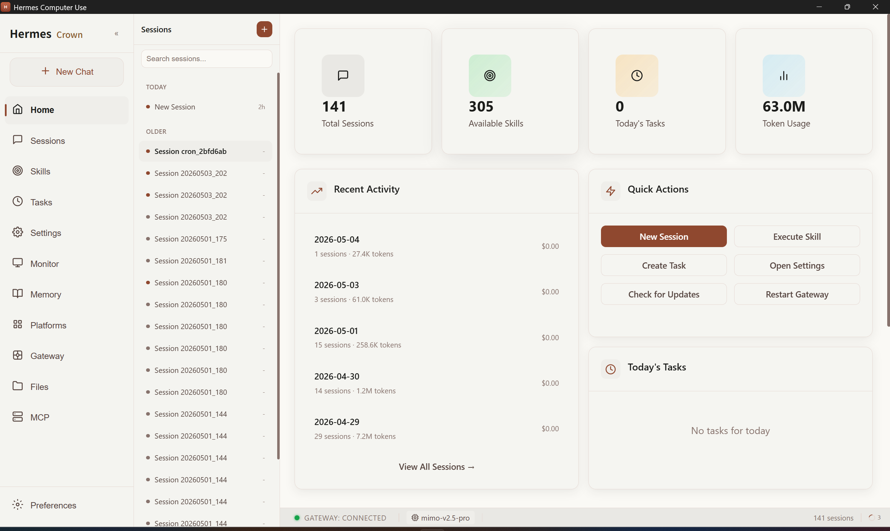
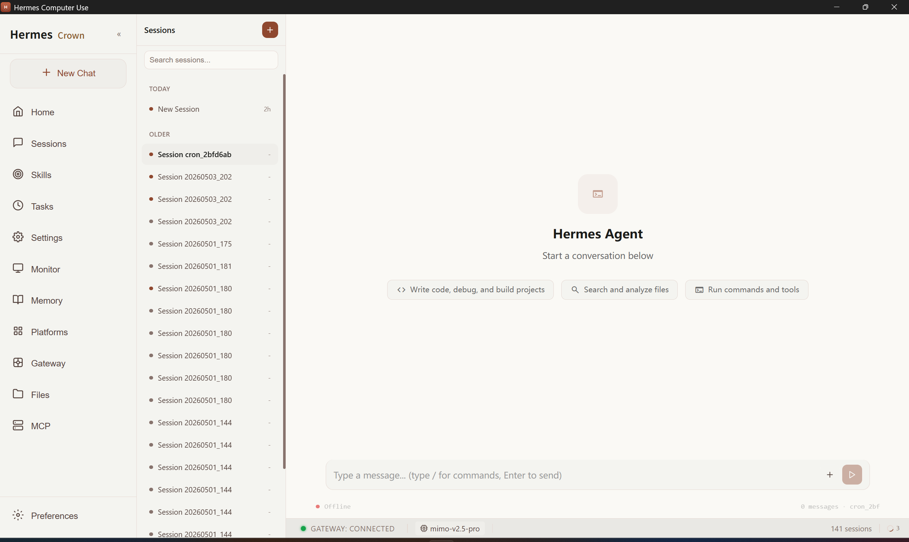
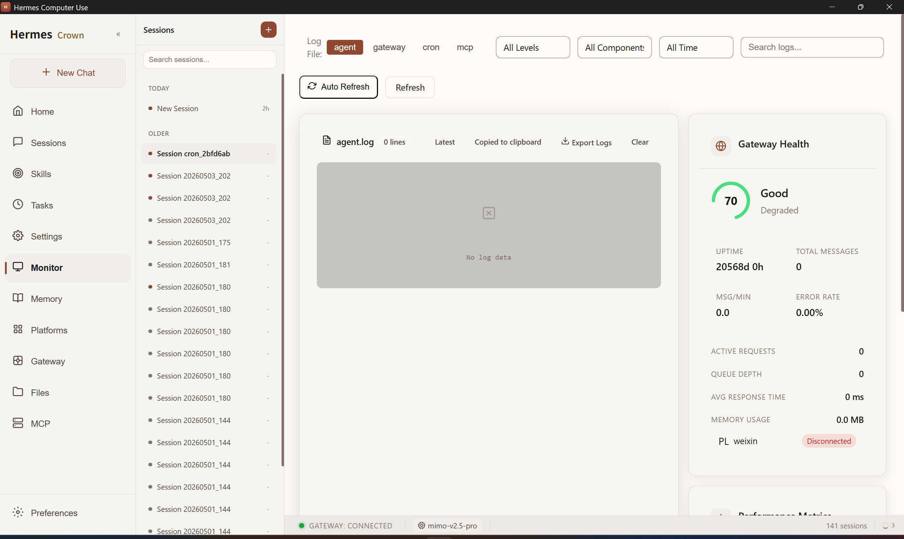
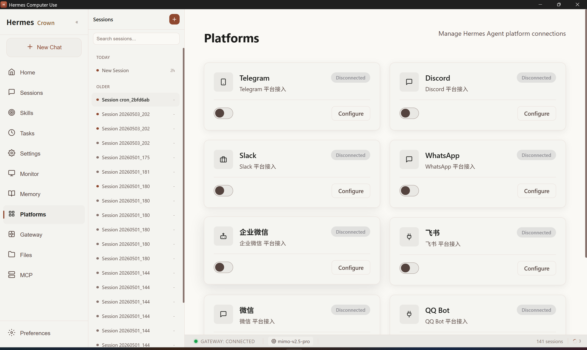

# Hermes Computer Use

<p align="center">
  <strong>Hermes Agent 桌面管理控制台</strong>
</p>

<p align="center">
  <a href="README_EN.md">English</a> | <a href="README.md">中文</a>
</p>

<p align="center">
  <a href="#功能特性">功能特性</a> •
  <a href="#安装">安装</a> •
  <a href="#开发">开发</a> •
  <a href="#贡献">贡献</a>
</p>

<p align="center">
  
  
  
  
  
</p>

---

[Hermes Computer Use](https://github.com/Crown-22/Hermes-Computer-Use) 是 [Hermes Agent](https://github.com/hermes-agent/hermes) 的桌面管理控制台应用，提供优雅的图形化界面来管理 AI Agent 的会话、技能、定时任务、配置等功能。经过深度优化，带来流畅、专业的管理体验。

## 功能特性

### 核心模块

- **🏠 仪表盘** - 系统状态概览、统计数据、快捷操作，一目了然掌握全局
- **💬 会话管理** - 查看和管理 AI 对话历史记录，支持搜索、分类、快速切换
- **⚡ 技能管理** - 浏览和配置 300+ Hermes Skills，一键启用/禁用
- **⏰ 定时任务** - 创建和管理 Cron Jobs，支持可视化调度配置
- **🧠 记忆管理** - 管理长期记忆条目，查看 AI 的上下文记忆状态
- **🔌 平台配置** - 配置 Telegram、Discord、微信、QQ 等多平台连接
- **📁 文件浏览** - 浏览工作目录文件，支持快速查找和预览
- **📊 系统监控** - 实时监控日志和性能指标，支持多维度筛选
- **💬 聊天界面** - 直接与 Hermes Agent 对话，支持命令补全

### 优化亮点

- **🎨 全新 UI 设计** - 现代化的界面风格，柔和的色彩搭配，长时间使用不疲劳
- **⚡ 极速响应** - Tauri 2 原生性能，启动快、占用少、运行流畅
- **🔍 智能搜索** - 全局搜索支持，快速定位会话、技能、配置项
- **📱 多平台集成** - 统一管理 8+ 通讯平台的 Agent 接入
- **🎯 可视化监控** - 实时健康度仪表盘，性能指标一目了然
- **🌙 状态感知** - 底部状态栏实时显示连接状态、模型信息、统计数据

## 截图

### 首页仪表盘

直观展示系统核心指标：总会话数、可用技能数、今日任务、Token 使用量。



### 会话管理

强大的会话管理功能，支持按时间分组、搜索、快速切换，轻松管理数百个对话。



### 系统监控

实时监控系统运行状态，包括网关健康度、性能指标、日志查看、错误率统计。



### 平台配置

统一管理 8+ 通讯平台的 Agent 接入：Telegram、Discord、Slack、微信、QQ、飞书等。



## 安装

### 前置要求

1. **Hermes Agent** - 必须先安装并配置 Hermes Agent
   ```bash
   pip install hermes-agent
   hermes config set model.api_key YOUR_API_KEY
   ```

2. **系统要求**
   - Windows 10/11
   - macOS 10.15+
   - Ubuntu 22.04+

### 下载安装

从 [Releases](https://github.com/Crown-22/Hermes-Computer-Use/releases) 页面下载对应平台的安装包：

| 平台 | 文件名 |
|------|--------|
| Windows | `Hermes.Computer.Use_x.x.x_x64-setup.exe` |
| macOS | `Hermes.Computer.Use_x.x.x_universal.dmg` |
| Linux | `hermes-computer-use_x.x.x_amd64.deb` |

### 首次运行

1. 启动 Hermes Computer Use
2. 如果未检测到 Hermes Agent，会显示引导界面
3. 按照引导完成配置
4. 开始使用！

## 开发

### 环境要求

- **Node.js** >= 18
- **Rust** >= 1.70
- **Hermes Agent** 已安装

### 本地开发

```bash
# 克隆仓库
git clone https://github.com/Crown-22/Hermes-Computer-Use.git
cd Hermes-Computer-Use/hermes-app

# 安装依赖
npm install

# 启动开发模式（热重载）
npm run tauri:dev
```

### 构建生产版本

```bash
npm run tauri:build
```

构建产物位于 `src-tauri/target/release/bundle/` 目录。

### 开发命令

| 命令 | 说明 |
|------|------|
| `npm run dev` | 仅启动前端开发服务器 |
| `npm run tauri:dev` | 启动 Tauri 开发模式（前端 + 后端） |
| `npm run tauri:build` | 构建生产版本 |
| `npm run build` | 仅构建前端 |

## 技术栈

### 前端

| 技术 | 版本 | 说明 |
|------|------|------|
| React | 19 | UI 框架 |
| TypeScript | 5.8 | 类型安全 |
| Vite | 7 | 构建工具 |
| Tailwind CSS | 4 | 样式框架 |
| Zustand | 5 | 状态管理 |

### 后端

| 技术 | 版本 | 说明 |
|------|------|------|
| Tauri | 2 | 跨平台桌面应用框架 |
| Rust | 1.70+ | 后端逻辑实现 |
| Serde | - | 序列化/反序列化 |

## 项目结构

```
hermes-app/
├── src/                      # 前端源码
│   ├── components/           # 可复用 UI 组件
│   │   ├── ui/              # 基础 UI 组件库
│   │   └── layout/          # 布局组件
│   ├── pages/                # 页面组件
│   │   ├── Dashboard/       # 首页仪表盘
│   │   ├── Sessions/        # 会话管理
│   │   ├── Skills/          # 技能管理
│   │   ├── CronJobs/        # 定时任务
│   │   ├── Settings/        # 系统设置
│   │   ├── Monitor/         # 系统监控
│   │   ├── Memory/          # 记忆管理
│   │   ├── Platforms/       # 平台配置
│   │   ├── Gateway/         # 网关管理
│   │   ├── Files/           # 文件管理
│   │   └── Chat/            # 聊天界面
│   ├── stores/               # Zustand 状态管理
│   ├── services/             # API 服务层
│   ├── hooks/                # 自定义 React Hooks
│   ├── utils/                # 工具函数
│   └── types/                # TypeScript 类型定义
├── src-tauri/                # Tauri 后端源码
│   ├── src/
│   │   ├── commands/        # Tauri 命令模块
│   │   ├── lib.rs           # 核心库
│   │   └── main.rs          # 入口文件
│   ├── Cargo.toml           # Rust 依赖配置
│   └── tauri.conf.json      # Tauri 配置
├── public/                   # 静态资源
│   └── screenshots/         # 应用截图
├── package.json              # Node.js 依赖
├── tsconfig.json             # TypeScript 配置
├── vite.config.ts            # Vite 配置
└── tailwind.config.js        # Tailwind CSS 配置
```

## 配置说明

### Hermes 配置

首次使用请复制配置模板（**勿将含真实密钥的 `config.yaml` 提交到 Git**）：

```bash
# 在 WSL / Linux 环境中
mkdir -p ~/.hermes
cp config.yaml.example ~/.hermes/config.yaml
# 编辑 ~/.hermes/config.yaml，填入你的 API Key
```

### 环境变量

创建 `.env` 文件配置以下变量：

```env
# Hermes Agent API 地址
VITE_HERMES_API_URL=http://localhost:9119

# 其他配置...
```

### Tauri 配置

在 `src-tauri/tauri.conf.json` 中配置应用信息：

```json
{
  "productName": "Hermes Computer Use",
  "version": "1.0.0",
  "identifier": "com.crown22.hermes-computer-use"
}
```

## 贡献

欢迎贡献！请查看 [CONTRIBUTING.md](CONTRIBUTING.md) 了解详情。

### 开发指南

1. Fork 本仓库
2. 创建功能分支 (`git checkout -b feature/amazing-feature`)
3. 提交更改 (`git commit -m 'feat: 添加某个功能'`)
4. 推送到分支 (`git push origin feature/amazing-feature`)
5. 创建 Pull Request

### 提交规范

使用 [Conventional Commits](https://www.conventionalcommits.org/) 规范：

- `feat:` 新功能
- `fix:` 修复 bug
- `docs:` 文档更新
- `style:` 代码格式（不影响功能）
- `refactor:` 重构
- `perf:` 性能优化
- `test:` 测试相关
- `chore:` 构建/工具相关

## 常见问题

### Q: 启动后显示"Offline"怎么办？

A: 请确保 Hermes Agent 已正确安装并运行。执行以下命令检查：

```bash
hermes status
```

### Q: 如何更新到最新版本？

A: 从 [Releases](https://github.com/Crown-22/Hermes-Computer-Use/releases) 页面下载最新版本安装包，覆盖安装即可。

### Q: 支持哪些 AI 模型？

A: 支持所有 Hermes Agent 支持的模型，包括 OpenAI、Claude、Gemini、国产大模型等。

## 许可证

本项目采用 [MIT License](LICENSE) 许可证。

## 致谢

- [Hermes Agent](https://github.com/hermes-agent/hermes) - 强大的 AI Agent 框架
- [Tauri](https://tauri.app/) - 现代化的桌面应用框架
- [React](https://react.dev/) - 流行的 UI 框架
- [Tailwind CSS](https://tailwindcss.com/) - 实用优先的 CSS 框架

## 联系方式

- **GitHub**: [Crown_22](https://github.com/Crown-22)
- **Issues**: [提交问题](https://github.com/Crown-22/Hermes-Computer-Use/issues)

---

<p align="center">
  Made with ❤️ by <a href="https://github.com/Crown-22">Crown_22</a>
</p>
